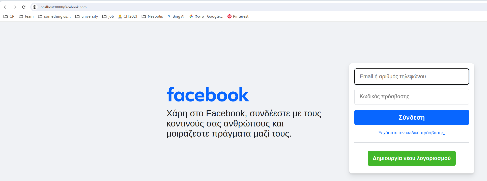
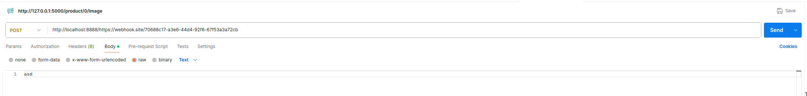
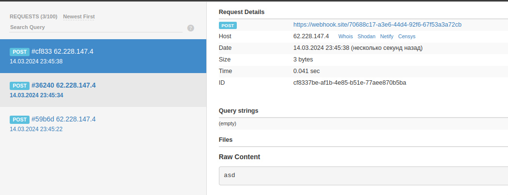
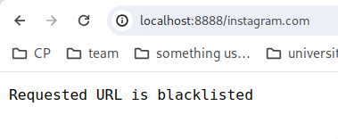
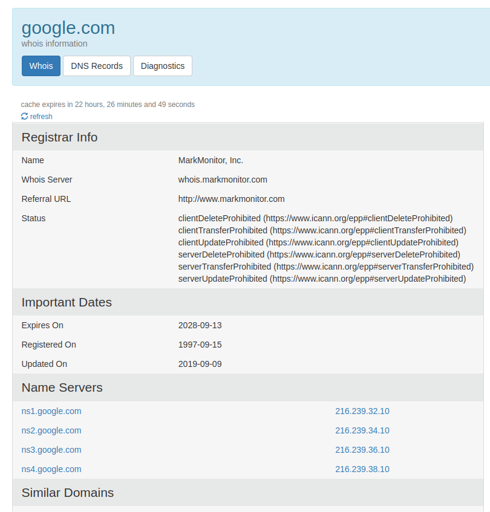
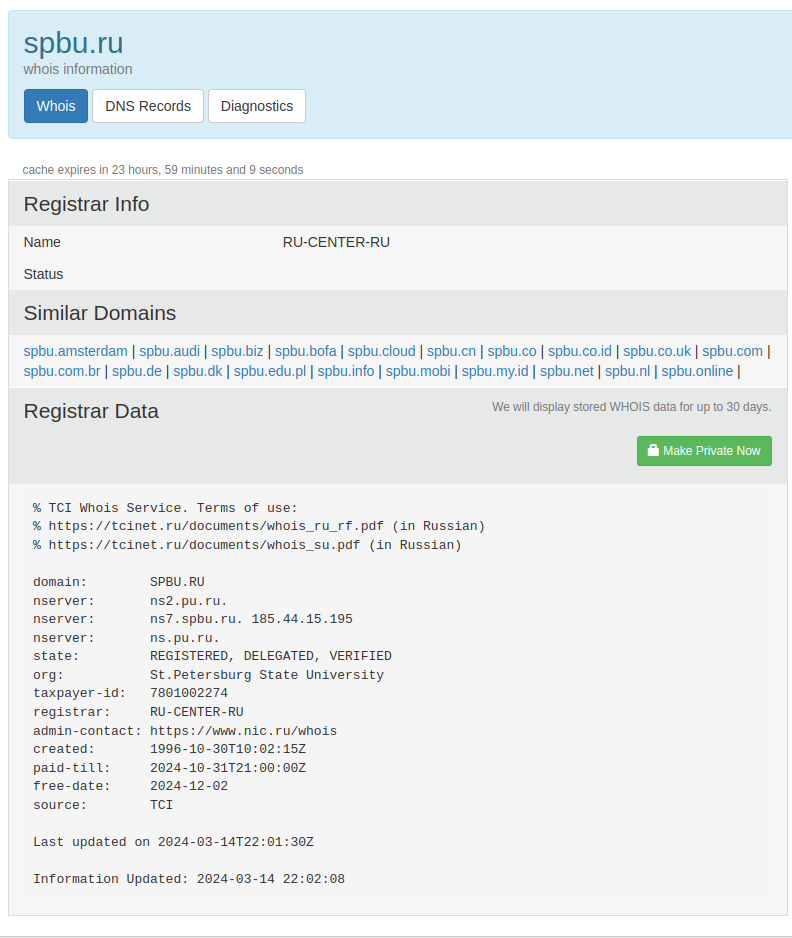

# Практика 4. Прикладной уровень

## Программирование сокетов: Прокси-сервер
Разработайте прокси-сервер для проксирования веб-страниц. 
Приложите скрины, демонстрирующие работу прокси-сервера. 

### Запуск прокси-сервера
Запустите свой прокси-сервер из командной строки, а затем запросите веб-страницу с помощью
вашего браузера. Направьте запросы на прокси-сервер, используя свой IP-адрес и номер порта.
Например, http://localhost:8888/www.google.com

_(*) Вы должны заменить стоящий здесь 8888 на номер порта в серверном коде, 
то есть тот, на котором прокси-сервер слушает запросы._

Вы можете также настроить непосредственно веб-браузер на использование вашего прокси сервера. 
В настройках браузера вам нужно будет указать адрес прокси-сервера и номер порта,
который вы использовали при запуске прокси-сервера (опционально).

### А. Прокси-сервер без кеширования (4 балла) -- сделал
1. Разработайте свой прокси-сервер для проксирования http GET запросов от клиента веб-серверу 
   с журналированием проксируемых HTTP-запросов. В файле журнала сохраняется
   краткая информация о проксируемых запросах (URL и код ответа). Кеширование в этом
   задании не требуется. **(2 балла)**
2. Добавьте в ваш прокси-сервер обработку ошибок. Отсутствие обработчика ошибок может
   вызвать проблемы. Особенно, когда клиент запрашивает объект, который не доступен, так
   как ответ 404 Not Found, как правило, не имеет тела, а прокси-сервер предполагает, что
   тело есть и пытается прочитать его. **(1 балл)**
3. Простой прокси-сервер поддерживает только метод GET протокола HTTP. Добавьте
   поддержку метода POST. В запросах теперь будет использоваться также тело запроса
   (body). Для вызова POST запросов вы можете использовать Postman. **(1 балл)**

Приложите скрины или логи работы сервера.

#### Демонстрация работы





### Б. Прокси-сервер с кешированием (4 балла) -- сделал
Когда прокси-сервер получает запрос, он проверяет, есть ли запрашиваемый объект в кэше, и,
если да, то возвращает объект из кэша без соединения с веб-сервером. Если объекта в кэше нет,
прокси-сервер извлекает его с веб-сервера обычным GET запросом, возвращает клиенту и
кэширует копию для будущих запросов.

Для проверки того, прокис объект в кеше или нет, необходимо использовать условный GET
запрос. В таком случае вам необходимо указывать в заголовке запроса значение для If-Modified-Since и If-None-Match. 
Подробности можно найти [тут](https://ruturajv.wordpress.com/2005/12/27/conditional-get-request).

Будем считать, что кеш-память прокси-сервера хранится на его жестком диске. Ваш прокси-сервер
должен уметь записывать ответы в кеш и извлекать данные из кеша (т.е. с диска) в случае
попадания в кэш при запросе. Для этого необходимо реализовать некоторую внутреннюю
структуру данных, чтобы отслеживать, какие объекты закешированы.

Приложите скрины или логи, из которых понятно, что ответ на повторный запрос был взят из кэша.

#### Демонстрация работы

```
$ python3 server.py 8888
running on localhost:8888


GET request: https://www.wikipedia.org/
https://www.wikipedia.org/: response 200


GET request: https://www.wikipedia.org/
GET: https://www.wikipedia.org/ getting from cache
```

### В. Черный список (2 балла) -- сделал
Прокси-сервер отслеживает страницы и не пускает на те, которые попадают в черный список. Вместо
этого прокси-сервер отправляет предупреждение, что страница заблокирована. Список доменов
и/или URL-адресов для блокировки по черному списку задается в **конфигурационном файле**.

Приложите скрины или логи запроса из черного списка.

#### Демонстрация работы



## Wireshark. Работа с DNS
Для каждого задания в этой секции приложите скрин с подтверждением ваших ответов.

### А. Утилита nslookup (1 балл) -- сделал

#### Вопросы
1. Выполните nslookup, чтобы получить IP-адрес какого-либо веб-сервера в Азии

```
$ nslookup www.iuj.ac.jp                                                                                                                                                                 [23:51:05]
Server:		192.168.10.254
Address:	192.168.10.254#53

Non-authoritative answer:
www.iuj.ac.jp	canonical name = webserv.iuj.ac.jp.
Name:	webserv.iuj.ac.jp
Address: 202.223.160.72
```

2. Выполните nslookup, чтобы определить авторитетные DNS-серверы для какого-либо университета в Европе

```
$ nslookup www.uni-bonn.de                                                                                                                                                               [23:51:24]
Server:		192.168.10.254
Address:	192.168.10.254#53

Non-authoritative answer:
www.uni-bonn.de	canonical name = www5.uni-bonn.de.
Name:	www5.uni-bonn.de
Address: 131.220.250.29
```

3. Используя nslookup, найдите веб-сервер, имеющий несколько IP-адресов. Сколько IP-адресов имеет веб-сервер вашего учебного заведения?

```
$ nslookup amazon.com                                                                                                                                                                    [23:56:01]
Server:		192.168.10.254
Address:	192.168.10.254#53

Non-authoritative answer:
Name:	amazon.com
Address: 205.251.242.103
Name:	amazon.com
Address: 54.239.28.85
Name:	amazon.com
Address: 52.94.236.248
```
   
У спбгу он всего один:

```
$ nslookup spbu.ru                                                                                                                                                                       [23:52:17]
Server:		192.168.10.254
Address:	192.168.10.254#53

Non-authoritative answer:
Name:	spbu.ru
Address: 81.89.183.226
```


### Е. Сервисы whois (2 балла) -- сделал
1. Что такое база данных whois?
   База данных WHOIS просто содержит информацию о доменных именах, включая владельца, контактную информацию и дату регистрации, нужна она для проверки доступности доменов и возможного мониторинга + связи с владельцем
2. Используя различные сервисы whois в Интернете, получите имена любых двух DNS-серверов. 
   Какие сервисы вы при этом использовали?
   
   

   например: `ns1.google.com` и `ns7.spbu.ru`

   использовал сайт `https://who.is`
3. Используйте команду nslookup на локальном хосте, чтобы послать запросы трем конкретным
   серверам DNS (по аналогии с Заданием Д): вашему локальному серверу DNS и двум DNS-серверам,
   найденным в предыдущей части.
   - <!-- todo -->
