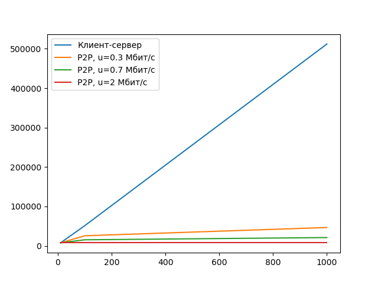

# Практика 5. Прикладной уровень

## Программирование сокетов.

### A. Почта и SMTP (7 баллов)

### 1. Почтовый клиент (2 балла) --- сделал
Напишите программу для отправки электронной почты получателю, адрес
которого задается параметром. Адрес отправителя может быть постоянным. Программа
должна поддерживать два формата сообщений: **txt** и **html**. Используйте готовые
библиотеки для работы с почтой, т.е. в этом задании **не** предполагается общение с smtp
сервером через сокеты напрямую.

Приложите скриншоты полученных сообщений (для обоих форматов).

#### Демонстрация работы

Запуск:
```
buyolitsez@archlinux: ~/projects/6sem/networks-course/lab05/email lab05!
$ python3 main.py --receiver ... --subject "Test" --content "<p style='color:red;'>red test</p>" --sender ... --password ...      [16:53:06]
receiver =  ...
subject = Test
content =  <p style='color:red;'>red test</p>
sender_address = ... 
sender_pass =  ...
```


```
    $ python3 main.py --receiver ... --subject "Test2" --content "test2" --sender ... --password ...                                [16:53:25]
receiver =  
subject = Test2
content =  test2
sender_address =  
sender_pass =  
```


### 2. SMTP-клиент (3 балла)
Разработайте простой почтовый клиент, который отправляет текстовые сообщения
электронной почты произвольному получателю. Программа должна соединиться с
почтовым сервером, используя протокол SMTP, и передать ему сообщение.
Не используйте встроенные методы для отправки почты, которые есть в большинстве
современных платформ. Вместо этого реализуйте свое решение на сокетах с передачей
сообщений почтовому серверу.

Сделайте скриншоты полученных сообщений.

#### Демонстрация работы
todo

### 3. SMTP-клиент: бинарные данные (2 балла)
Модифицируйте ваш SMTP-клиент из предыдущего задания так, чтобы теперь он мог
отправлять письма с изображениями (бинарными данными).

Сделайте скриншот, подтверждающий получение почтового сообщения с картинкой.

#### Демонстрация работы
todo

---

_Многие почтовые серверы используют ssl, что может вызвать трудности при работе с ними из
ваших приложений. Можете использовать для тестов smtp сервер СПбГУ: mail.spbu.ru, 25_

### Б. Удаленный запуск команд (3 балла) -- сделал
Напишите программу для запуска команд (или приложений) на удаленном хосте с помощью TCP сокетов.

Например, вы можете с клиента дать команду серверу запустить приложение Калькулятор или
Paint (на стороне сервера). Или запустить консольное приложение/утилиту с указанными
параметрами. Однако запущенное приложение **должно** выводить какую-либо информацию на
консоль или передавать свой статус после запуска, который должен быть отправлен обратно
клиенту. Продемонстрируйте работу вашей программы, приложив скриншот.

Например, удаленно запускается команда `ping yandex.ru`. Результат этой команды (запущенной на
сервере) отправляется обратно клиенту.

#### Демонстрация работы


### В. Широковещательная рассылка через UDP (2 балла) -- сделал
Реализуйте сервер (веб-службу) и клиента с использованием интерфейса Socket API, которая:
- работает по протоколу UDP
- каждую секунду рассылает широковещательно всем клиентам свое текущее время
- клиент службы выводит на консоль сообщаемое ему время

#### Демонстрация работы


## Задачи

### Задача 1 (2 балла) -- сделал
Рассмотрим короткую, $10$-метровую линию связи, по которой отправитель может передавать
данные со скоростью $150$ бит/с в обоих направлениях. Предположим, что пакеты, содержащие
данные, имеют размер $100000$ бит, а пакеты, содержащие только управляющую информацию
(например, флаг подтверждения или информацию рукопожатия) – $200$ бит. Предположим, что у
нас $10$ параллельных соединений, и каждому предоставлено $1/10$ полосы пропускания канала
связи. Также допустим, что используется протокол HTTP, и предположим, что каждый
загруженный объект имеет размер $100$ Кбит, и что исходный объект содержит $10$ ссылок на другие
объекты того же отправителя. Будем считать, что скорость распространения сигнала равна
скорости света ($300 \cdot 10^6$ м/с).
1. Вычислите общее время, необходимое для получения всех объектов при параллельных
непостоянных HTTP-соединениях
2. Вычислите общее время для постоянных HTTP-соединений. Ожидается ли существенное
преимущество по сравнению со случаем непостоянного соединения?

#### Решение
Вычислим время распределения $t = \dfrac{10}{3 \cdot 10^8} \approx 0.00000003$, каждый пользователь имеет скорость 15 бит/с, значит $RTT = 2\left(t + \dfrac{200}{15}\right) \approx 26.6666667$. Теперь время передачи основного файла выражается как $R = t + \dfrac{10^5}{15} \approx 6666.6666667$.
Тогда непостоянное соединение передаст за $11 (2 \cdot RTT + R) \approx 73920$ секунд, а постоянное за $RTT + 11 (RTT + R) \approx 73653$ секунд
1. 73920 секунд
2. 73653 секунд, улучшение на 0.36\%. Ожидаемо в рамках того что передаем огромные файлы, поэтому время на создание соединения не очень влияет

### Задача 2 (3 балла) -- сделал
Рассмотрим раздачу файла размером $F = 15$ Гбит $N$ пирам. Сервер имеет скорость отдачи $u_s = 30$
Мбит/с, а каждый узел имеет скорость загрузки $d_i = 2$ Мбит/с и скорость отдачи $u$. Для $N = 10$, $100$
и $1000$ и для $u = 300$ Кбит/с, $700$ Кбит/с и $2$ Мбит/с подготовьте график минимального времени
раздачи для всех сочетаний $N$ и $u$ для вариантов клиент-серверной и одноранговой раздачи.

#### Решение
```
client-server, N = 10, equals  7680.0
client-server, N = 100, equals  51200.0
client-server, N = 1000, equals  512000.0
p2p, N=10, U=0.3, equals 7680.0
p2p, N=100, U=0.3, equals 25600.0
p2p, N=1000, U=0.3, equals 46545.454545454544
p2p, N=10, U=0.7, equals 7680.0
p2p, N=100, U=0.7, equals 15360.0
p2p, N=1000, U=0.7, equals 21041.095890410958
p2p, N=10, U=2, equals 7680.0
p2p, N=100, U=2, equals 7680.0
p2p, N=1000, U=2, equals 7680.0
```



### Задача 3 (3 балла) -- сделал
Рассмотрим клиент-серверную раздачу файла размером $F$ бит $N$ пирам, при которой сервер
способен отдавать одновременно данные множеству пиров – каждому с различной скоростью,
но общая скорость отдачи при этом не превышает значения $u_s$. Схема раздачи непрерывная.
1. Предположим, что $\dfrac{u_s}{N} \le d_{min}$.
   При какой схеме общее время раздачи будет составлять $\dfrac{N F}{u_s}$?
2. Предположим, что $\dfrac{u_s}{N} \ge d_{min}$. 
   При какой схеме общее время раздачи будет составлять  $\dfrac{F}{d_{min}}$?
3. Докажите, что минимальное время раздачи описывается формулой $\max\left(\dfrac{N F}{u_s}, \dfrac{F}{d_{min}}\right)$?

#### Решение

1. Если отдавать всем одновременно и равномерно, то скорость передачи будет $\dfrac{u_s}{N} \leq d_{min}$, значит все успевают принимать и нет задержек, значит суммарное время передачи будет $\dfrac {N F} {u_s}$
2. Опять отправляем всем одновременно, но со скоростью $d_{min}$, тогда суммарная скорость будет $N d_{min} \leq u_s$(т.е. хватает) и как раз все файлы передадим за $\dfrac F {d_{min}}$
3. обозначим $d = d_{min}$(чтобы меньше писать)

Понятно что за время $\max\left(\dfrac{N F}{u_s}, \dfrac{F}{d_{min}}\right)$ передать точно можно, ведь это напрямую следует из пунктов 1,2(ведь хотя бы один из них верен)

Покажем что нельзя быстрее. Действительно, если рассмотреть самый медленный сервер, то он точно должен потратить на прием $\dfrac{F}{d_{min}}$ времени.
А сервер должен отправить $\dfrac{N F}{u_s}$ данных.
Получили что нижняя и верхние оценки схлопнулись.
