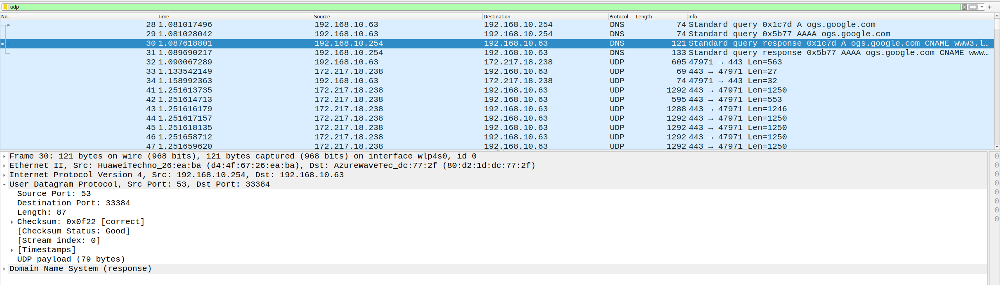
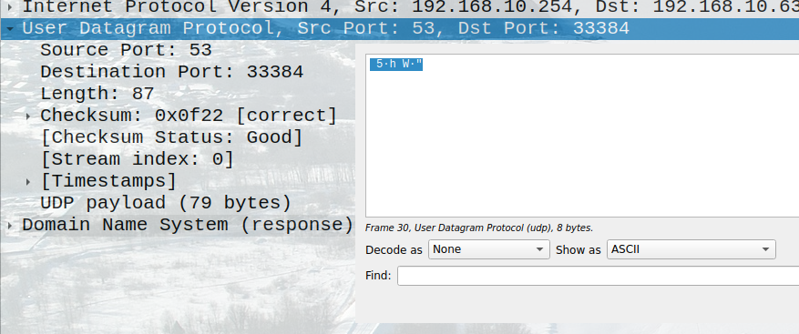
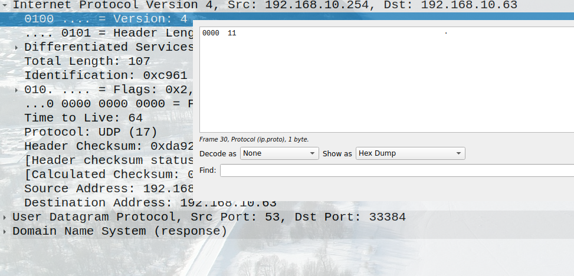
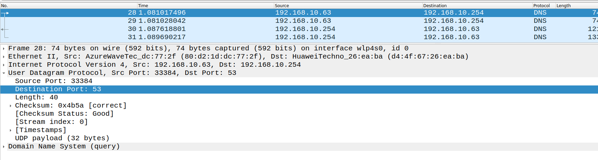
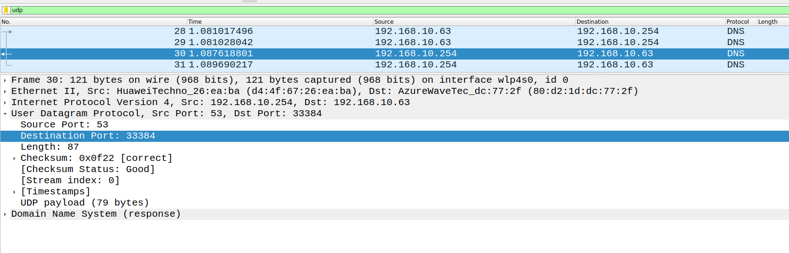
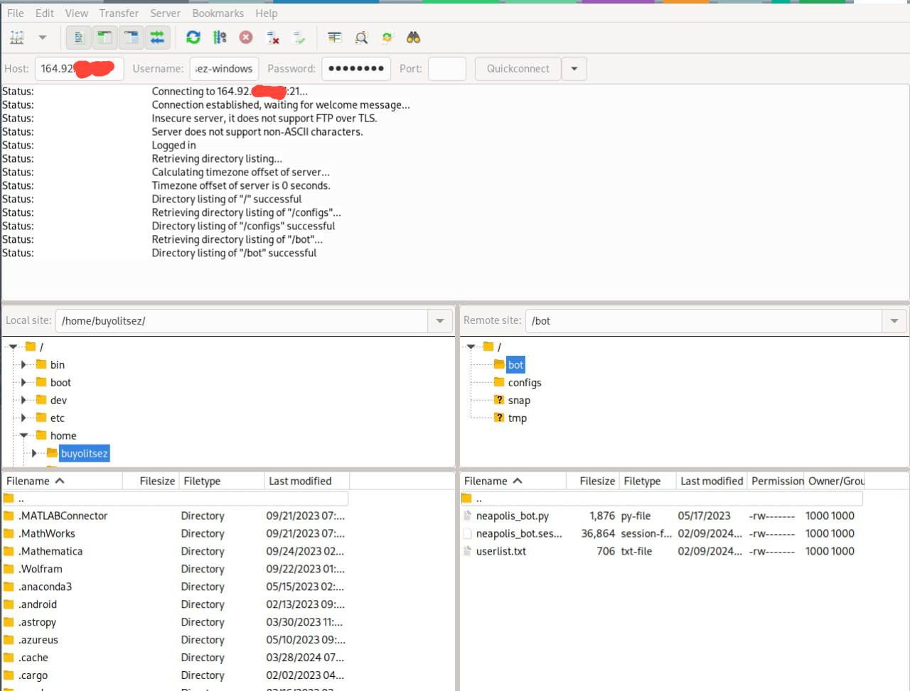
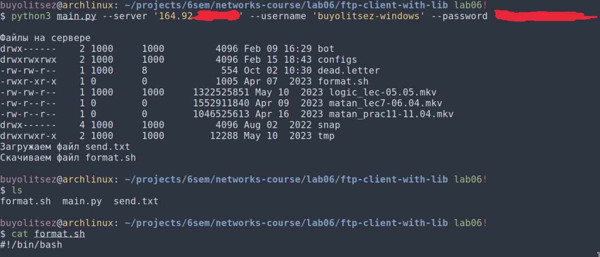
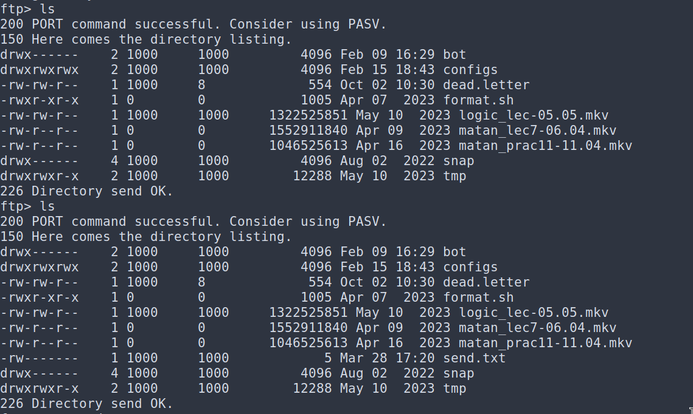

# Практика 6. Транспортный уровень

## Wireshark: UDP (5 баллов) -- сделал
Начните захват пакетов в приложении Wireshark и затем сделайте так, чтобы ваш хост отправил и
получил несколько UDP-пакетов (например, с помощью обращений DNS).
Выберите один из UDP-пакетов и разверните поля UDP в окне деталей заголовка пакета.
Ответьте на вопросы ниже, представив соответствующие скрины программы Wireshark.

#### Вопросы
КАРТИНКИ ЕСТЬ, ПО НЕВЕДОМЫМ 
1. Выберите один UDP-пакет. По этому пакету определите, сколько полей содержит UDP-заголовок.
   - 4 поля

2. Определите длину (в байтах) для каждого поля UDP-заголовка, обращаясь к отображаемой
   информации о содержимом полей в данном пакете.
   - каждое поле по 2 байта

3. Значение в поле Length (Длина) – это длина чего?
   - длину заголовка + данных
4. Какое максимальное количество байт может быть включено в полезную нагрузку UDP-пакета?
   - максимальное значение в Length это $2^{16} - 1$, но у нас всегда есть 8байтный заголовок, поэтому ответ $2^{16} - 9 = 65527$
5. Чему равно максимально возможное значение номера порта отправителя?
   - два байта -> максимальное значение $2^{16} - 1 = 65535$
6. Какой номер протокола для протокола UDP? Дайте ответ и для шестнадцатеричной и
   десятеричной системы. Чтобы ответить на этот вопрос, вам необходимо заглянуть в поле
   Протокол в IP-дейтаграмме, содержащей UDP-сегмент.
   - $11_{16}$ или $17_{10}$.

7. Проверьте UDP-пакет и ответный UDP-пакет, отправляемый вашим хостом. Определите
   отношение между номерами портов в двух пакетах.
   - у первого Source Port: 33384, Destination Port: 53

   у ответного Source Port: 53, Destination Port: 33384

   т.е. они поменялись местами

--

## Программирование. FTP

### FileZilla сервер и клиент (3 балла) -- сделал
1. Установите сервер и клиент [FileZilla](https://filezilla.ru/get)
2. Создайте FTP сервер. Например, по адресу 127.0.0.1 и портом 21. 
   Укажите директорию по умолчанию для работы с файлами.
3. Создайте пользователя TestUser. Для простоты и удобства можете отключить использование сертификатов.
4. Запустите FileZilla клиента (GUI) и попробуйте поработать с файлами (создать папки,
добавить/удалить файлы).

Приложите скриншоты.

#### Скрины
у меня есть личный сервер с постоянным ip на котором я поднимал ftp для себя, поэтому я подключался к нему

### FTP клиент (3 балла) -- сделал
Создайте консольное приложение FTP клиента для работы с файлами по FTP. Приложение может
обращаться к FTP серверу, созданному в предыдущем задании, либо к какому-либо другому серверу 
(есть много публичных ftp-серверов для тестирования, [вот](https://dlptest.com/ftp-test/) один из них).

Приложение должно:
- Получать список всех директорий и файлов сервера и выводить его на консоль
- Загружать новый файл на сервер
- Загружать файл с сервера и сохранять его локально

Бонус: Не используйте готовые библиотеки для работы с FTP (например, ftplib для Python), а реализуйте решение на сокетах **(+3 балла)**.

#### Демонстрация работы

---

