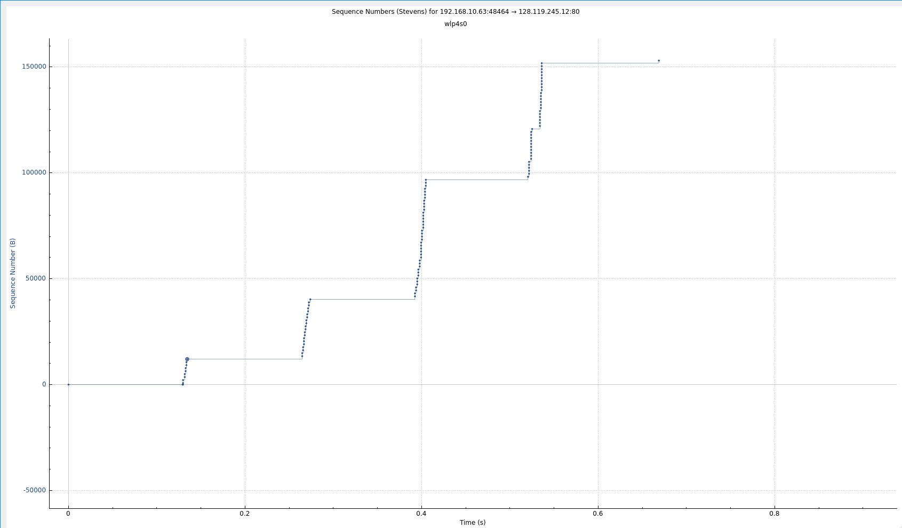

# Практика 7. Транспортный уровень

сделал:

Wireshark: TCP (5 баллов)

Работа с Time-Sequence-Graph (Stevens) (2 балла)

А. Серверная часть (2 балла)

Б. Клиентская часть (2 балла)

В. Вывод в формате ping (2 балла)

Задача 1 (3 балла)

Задача 2 (2 балла) 

Итого: 16

## Wireshark: TCP (5 баллов) -- сделал

### Перехват TCP-передачи данных от вашего компьютера удаленному серверу
При ответе на вопросы прикладывайте соответствующие скрины программы Wireshark.

#### Подготовка
1. Откройте веб-браузер и перейдите по ссылке gaia.cs.umass.edu/wireshark-labs/alice.txt.
   Здесь вы найдете копию книги «Алиса в стране чудес» в формате ASCII. Сохраните этот файл 
   на свой компьютер.
2. Перейдите по ссылке: gaia.cs.umass.edu/wireshark-labs/TCP-wireshark-file1.html. Сюда вы
   будете загружать ранее сохраненный файл.
3. Запустите Wireshark и начните перехват пакетов.
4. Теперь загрузите текстовый файл «Алиса в стране чудес» на указанной в п.2 страничке.
5. Остановите захват пакетов в приложении Wireshark. Используйте фильтр пакетов tcp.

#### Вопросы

1. Какой IP-адрес и номер порта TCP использует ваш компьютер (отправитель), передающий
   файл серверу gaia.cs.umass.edu? Для ответа на вопрос, возможно, проще выбрать http-сообщение
   и рассмотреть информацию TCP-пакета, используемого для передачи этого http-сообщения, 
   в окне деталей заголовка пакета.

    - 192.168.10.63:48464

2. Каков IP-адрес у сервера gaia.cs.umass.edu? Каковы номера портов для отправки и приема
   TCP-сегментов этого соединения?
   - 128.119.245.12
   - 80

3. Какой порядковый номер у SYN TCP-сегмента, который используется для установления
   TCP-соединения между компьютером клиента и сервером gaia.cs.umass.edu? Как
   определяется, что это именно SYN-сегмент?

   - 0
   - по флагу
4. Какой порядковый номер у SYNACK-сегмента, отправленного сервером gaia.cs.umass.edu
   на компьютер клиента в ответ на SYN-сегмент? Какое значение хранится в поле
   подтверждения в SYNACK-сегменте? Как сервер gaia.cs.umass.edu определил это значение?
   Как определяется, что это именно SYNACK-сегмент?

   - 0
   - 1
   - номер полученного + 1
   - опять по флагам
5. Какой порядковый номер у TCP-сегмента, содержащего команду POST протокола HTTP?
   (для нахождения команды POST вам потребуется проникнуть внутрь поля содержимого
   пакета в нижней части окна Wireshark, чтобы найти сегмент, в поле DATA которого
   хранится значение POST)

   - 1
6. Рассмотрите TCP-сегмент, содержащий команду POST протокола HTTP, как первый TCP-сегмент 
   соединения. Какие порядковые номера у первых шести сегментов TCP-соединения 
   (включая сегмент, содержащий команду POST протокола HTTP)? Когда был
   отправлен каждый сегмент? Когда был получен ACK-пакет для каждого сегмента?
   Покажите разницу между тем, когда каждый TCP-сегмент был отправлен и когда было
   получено каждое подтверждение, чему равно значение RTT для каждого из 6 сегментов?

   - 1, 727, 2139, 3551, 4963, 6375
   - 3.177333902, 3.177411017, 3.177415034, 3.179311680, 3.179316128, 3.180368571
   - 3.194025362, 3.194091376, 3.194128032, 3.196235298, 3.196239109, 3.197053423
   - 0.016691460, 0.016680359, 0.016712998, 0.016923618, 0.016922981, 0.016684852

   Тогда RTT = 0.016769378, т.е. примерно 16 миллисекунд

7. Чему равна пропускная способность (количество байтов, передаваемых в единицу
   времени) для этого TCP-соединения? Объясните, как вы получили это значение.
   - $\dfrac {32128} {0.016769378} = 1915873.0872427109$ байт в секунду
   - разделил размер окна Win на RTT

### Работа с Time-Sequence-Graph (Stevens) (2 балла) -- сделал
Time-Sequence-Graph (Stevens) (Временная шкала (Стивенса)) – одна из графических утилит
Wireshark для протокола TCP. Для того, чтобы ее запустить, выберите TCP-сегмент в окне
захваченных полученных пакетов. Затем выберите команду меню Statistics => TCP Stream Graph =>
Time-Sequence-Graph (Stevens) (Статистика => График TCP потока => Временная шкала (Стивенса)).
Каждая точка представляет отправленный TCP-сегмент, на графике изображена зависимость
порядкового номера сегмента от времени, когда он был отправлен.

#### Подготовка (такая же, как в предыдущем задании)
1. Откройте веб-браузер и перейдите по ссылке gaia.cs.umass.edu/wireshark-labs/alice.txt.
   Здесь вы найдете копию книги «Алиса в стране чудес» в формате ASCII. Сохраните этот файл на
   свой компьютер.
2. Перейдите по ссылке: gaia.cs.umass.edu/wireshark-labs/TCP-wireshark-file1.html. Сюда вы
   будете загружать ранее сохраненный файл.
3. Запустите Wireshark и начните перехват пакетов
4. Теперь загрузите текстовый файл «Алиса в стране чудес» на указанной в п.2 страничке
5. Остановите захват пакетов в приложении Wireshark. Используйте фильтр пакетов tcp.

#### Задание
Используйте инструмент построения графиков Time-Sequence-Graph (Stevens), чтобы представить
изменение порядковых номеров на временной шкале для сегментов, отправленных от клиента
серверу gaia.cs.umass.edu. Приложите соответствующий скрин программы Wireshark.

#### Скрин

## Программирование. Эхо-запросы через UDP
Реализуйте сервер для пингования, а также его клиента.

### А. Серверная часть (2 балла) -- сделал
Сервер находится в бесконечном цикле, ожидая приходящие UDP-пакеты.
Если пакет прибывает, то сервер просто изменяет символы входящего сообщения на заглавные и
отправляет их обратно клиенту. Серверный код должен моделировать 20% потерю пакетов.

### Б. Клиентская часть (2 балла) --сделал
Клиент должен отправить 10 эхо-запросов серверу. Поскольку UDP является ненадежным с точки
зрения доставки протоколом, то пакет, отправленный от клиента к серверу или наоборот, может
быть потерян в сети. Так как клиент не может бесконечно ждать ответа на запрос, нужно задать
период ожидания ответа (тайм-аут), равный одной секунде – если ответ не будет получен в
течение одной секунды, клиентская программа должна предполагать, что пакет потерян.

Ваша клиентская программа должна:
- отправить эхо-запрос, используя UDP
- распечатать ответное сообщение от сервера (если такое есть)
- вычислить и вывести на печать время оборота (RTT) в секундах для каждого пакета при
ответе сервера
- в противном случае, вывести сообщение «Request timed out»

Формат сообщения:
`Ping номер_последовательности время`
- номер_последовательности начинается с 1 и увеличивается до 10 для каждого
последующего сообщения, отправленного клиентом
- время – это момент времени, когда клиент отправляет сообщение

Сделайте скриншоты, подтверждающие корректную работу вашей программы пингования со стороны клиента.

#### Демонстрация работы

### В. Вывод в формате ping (2 балла) -- сделал
Версия клиента из предыдущей части (Б) вычисляет время оборота для каждого пакета и выводит
его отдельно. Измените вывод таким образом, чтобы он соответствовал тому, как это делается в
стандартной утилите ping.

Для этого вам нужно будет сообщить минимальное, максимальное и среднее значение RTT в
конце каждого ответа от сервера. Дополнительно вычислите коэффициент потери пакетов (в
процентах).

#### Демонстрация работы

### Г. UDP Heartbeat (4 балла)
UDP Heartbeat (монитор доступности) подобен программе пингования. Он может быть
использован для проверки, работает ли приложение, и вывода сообщения об односторонней
потере пакетов.

Клиент отправляет порядковый номер и текущую временную метку в пакете UDP на сервер,
который слушает «сердцебиение» (т.е. ожидает UDP-пакеты) клиента. После получения пакетов
сервер вычисляет разницу во времени и сообщает о потерях. Если пакеты отсутствуют
определенный период времени, заданный параметром, то делается предположение, что
клиентское приложение остановлено и соответствующее сообщение выводится на консоль
сервера.

Реализуйте UDP Heartbeat (обе части – клиент и сервер), доработав обе ваши части программы
пингования из заданий А и Б.

Обратите внимание, что клиентов у сервера может быть сразу несколько одновременно.
Протестируйте такой сценарий.

#### Демонстрация работы
todo

## Задачи

### Задача 1 (3 балла) --- сделал
Рассмотрим протоколы GBN и SR. Предположим, пространство порядковых номеров имеет размер $k$.

Постановка задачи: найти наибольшее допустимое окно передачи, которое позволит обойти
возникновение проблемы, показанной на рисунке для каждого из этих протоколов?

Описание проблемы:
Отсутствие синхронизации между окнами отправителя и получателя имеет важные последствия,
когда мы сталкиваемся с ограниченностью диапазона порядковых номеров. Рассмотрим, что
могло бы произойти, например, если у нас есть четыре пакета с порядковыми номерами 0, 1, 2, 3,
а размер окна равен трем. Предположим, пакеты с 0 по 2 переданы отправителем, корректно
получены и подтверждены получателем. В этот момент окно получателя заполняется четвертым,
пятым и шестым пакетами, которые имеют порядковые номера 3, 0 и 1, соответственно. Теперь
рассмотрим два сценария.

В первом сценарии (на рисунке сверху) квитанции ACK на первые три пакета доставлены верно.
Таким образом, отправитель сдвигает окно вперед и отправляет четвертый, пятый и шестой
пакеты с порядковыми номерами 3, 0 и 1 соответственно.
Пакет с порядковым номером 3 потерян, но пакет с порядковым номером 0, **содержащий новые данные**, 
получен.

Во втором случае (рисунок снизу) ACK пакеты для первых трех пакетов данных потеряны, и
отправитель пересылает эти пакеты. Таким образом, получатель далее получает пакет с
порядковым номером 0 — **копию первого отправленного**.
Теперь рассмотрим ту же ситуацию с точки зрения принимающей стороны. Действия,
выполняемые передающей стороной, скрыты от нее; принимающая сторона способна лишь
следить за последовательностями получаемых пакетов и генерируемых квитанций. Подобная
ограниченность приводит к тому, что обе описанные выше ситуации воспринимаются
принимающей стороной как одинаковые. Она не может отличить исходную передачу пакета от
повторной.

#### Решение

В обоих случаях за $k$ обозначаю размер пространства номеров пакетов

**GBN**

Свойство: если пакет теряется, то отправитель повторно отправляет все пакеты начиная с потерянного.

Понятно, что если размер окна это $k$, то получатель не поймет, ему повторно пришел пакет номер 0 потому что это новый пакет или же отправитель не получил ACK?
Поэтому необходим размер окна меньше чем пространство номеров пакетов, т.е. $k - 1$. тем самым даже если все пакеты в окне потеряны, получатель будет ожидать пакет с порядковым номером $k-1$, поэтому когда он получит пакет с номером 0, он будет знать, что это повторно отправленный пакет

**SR**

Свойство: если пакет теряется, то отправитель повторно отправляет потерянный пакет.

размер окна должен быть не больше $\dfrac k 2$, чтобы для двух окон не было пересечений номеров пакетов.
Тем самым, даже если потеряны все пакеты в окне, то получатель будет ожидать пакет с порядковым номером $\dfrac k 2$ следующим. Поэтому, когда он получит пакет с порядковым номером 0, он будет знать, что это повторно отправленный пакет

### Задача 2 (2 балла) -- cделал
Представим себе следующую ситуацию: один хост расположен в Санкт-Петербурге, а другой — во
Владивостоке. Пусть время оборота RTT между этими двумя хостами приблизительно равно $30$ мс.
Предположим далее, что хосты соединены каналом со скоростью передачи $R$, равной $1$ Гбит/с
($10^9$ бит/с).

Предположим, что размер передаваемого пакета составляет $1500$ байт, включая поля
заголовка и данные.

Насколько большим должен быть размер окна $n$, чтобы использование канала составило
более $98$ процентов?

#### Решение

Мы хотим чтобы $U_{\text{отправитель}} \geq 0.98$, по формуле:

$$U_{\text{отправитель}} = n \cdot \frac {L/R} {RTT + L/R} \geq 0.98 \iff n \cdot \frac {1500 \cdot 8 /10^9} {0.03 + 1500 \cdot 8 / 10^9} \approx n \cdot 0.00039984006397441024$$

Т.е. необходим $n \geq 2451$.
