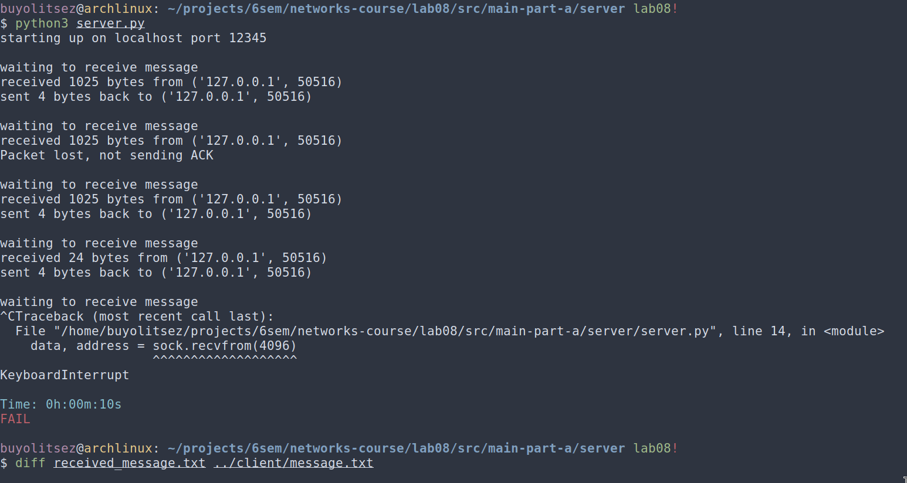
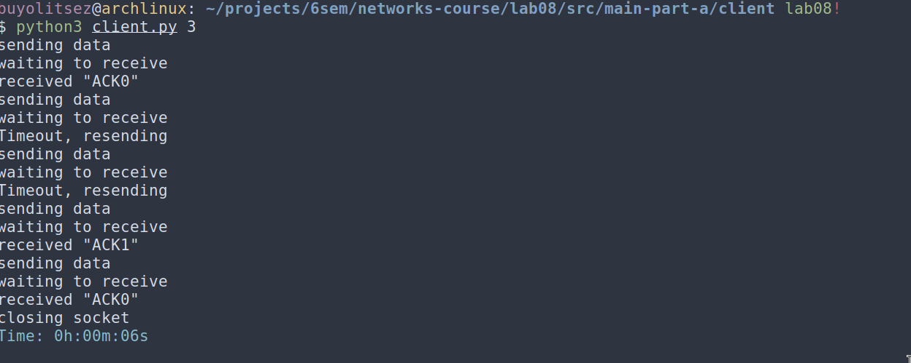
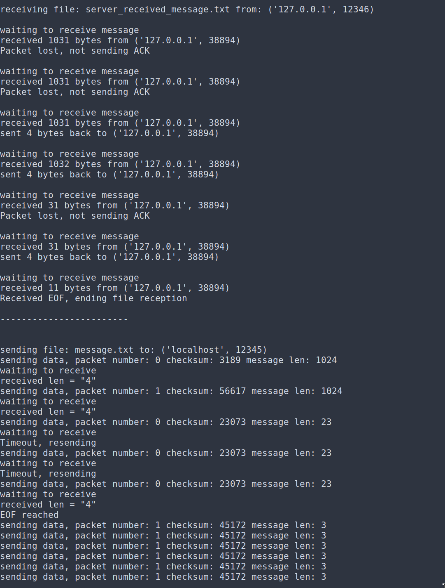
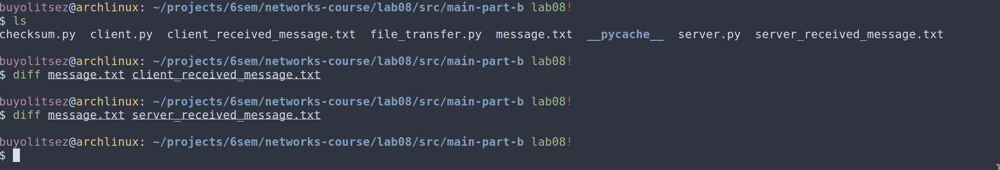
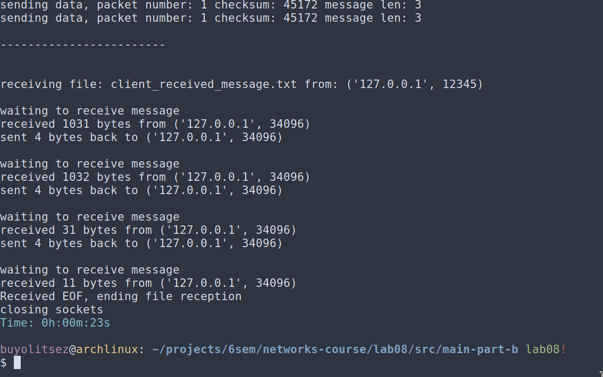
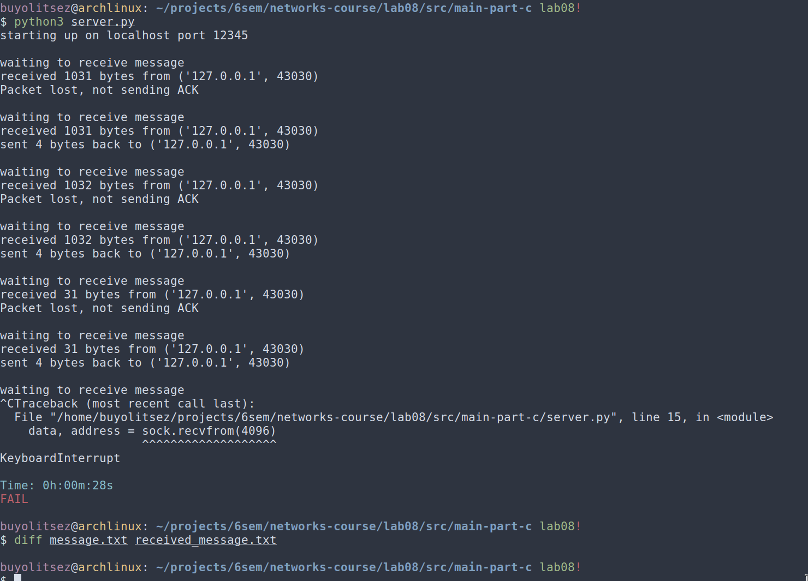
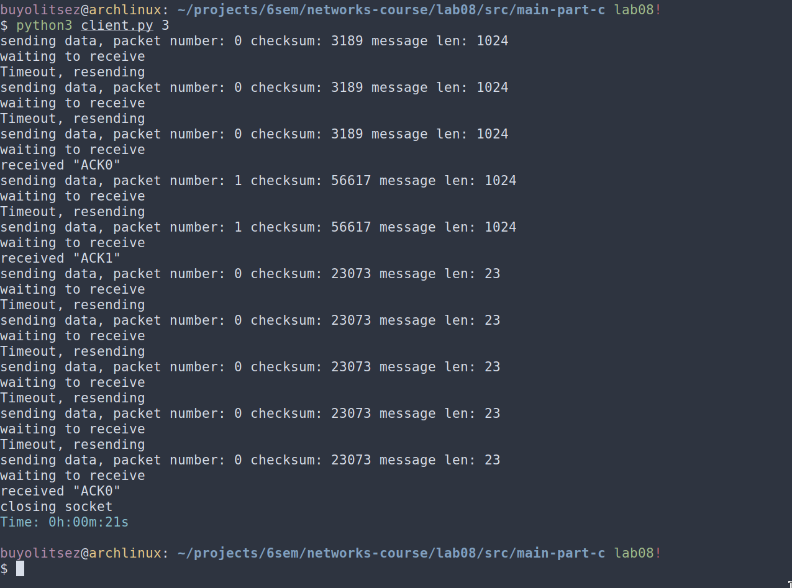
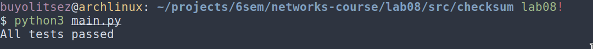

# Практика 8. Транспортный уровень

сделал:

А. Общие требования (5 баллов) 

Б. Дуплексная передача (2 балла) 

В. Контрольные суммы (1 балл)

Контрольные суммы (2 балла)

Задача 1 (2 балла)

Задача 3 (2 балла)

Задача 4. Расслоение TCP (2 балла)

Итого: 16

## Реализация протокола Stop and Wait (8 баллов)
Реализуйте свой протокол надежной передачи данных типа Stop and Wait на основе ненадежного
транспортного протокола UDP. В вашем протоколе, реализованном на прикладном уровне,
отправитель отправляет пакет (frame) с данными, а затем ожидает подтверждения перед
продолжением.

**Клиент**
- отправляет пакет и ожидает подтверждение ACK от сервера в течение заданного времени (тайм-аута)
- если ACK не получен, пакет отправляется снова
- все пакеты имеют номер (0 или 1) на случай, если один из них потерян

**Сервер**
- ожидает пакеты, отправляет ACK, когда пакет получен
- отправленный ACK должен иметь тот же номер, что и полученный пакет

Вы можете использовать схему, которая была рассмотрена на лекции в рамках обсуждения
протокола rdt3.0, как пример:

### А. Общие требования (5 баллов) -- сделал
- В качестве базового протокола используйте UDP. Поддержите имитацию 30% потери
  пакетов. Потеря может происходить в обоих направлениях (от клиента серверу и от
  сервера клиенту).
- Должен быть поддержан настраиваемый таймаут.
- Должна быть обработка ошибок (как на сервере, так и на клиенте).
- В качестве демонстрации работоспособности вашего решения передайте через свой
  протокол файл (от клиента на сервер), разбив его на несколько пакетов перед отправкой
  на стороне клиента и собрав из отдельных пакетов в единый файл на стороне сервера.
  Файл и размеры пакетов выберите самостоятельно.

Приложите скриншоты, подтверждающие работоспособность программы.

#### Демонстрация работы

Таймаут передается клиенту как количество секунд, дефолтно 5.

`diff` ничего не вывел, т.к. файлы совпали

### Б. Дуплексная передача (2 балла) 
Поддержите возможность пересылки данных в обоих направлениях: как от клиента к серверу, так и
наоборот. 

Продемонстрируйте передачу файла от сервера клиенту.

#### Демонстрация работы

сервер:

клиент:

### В. Контрольные суммы (1 балл) -- сделал
UDP реализует механизм контрольных сумм при передаче данных. Однако предположим, что
этого нет. Реализуйте и интегрируйте в протокол свой способ проверки корректности данных
на прикладном уровне (для этого вы можете использовать результаты из следующего задания
«Контрольные суммы»).

## Контрольные суммы (2 балла) -- сделал
Методы, основанные на использовании контрольных сумм, обрабатывают $d$ разрядов данных как
последовательность $k$-разрядных целых чисел.
Наиболее простой метод заключается в простом суммировании этих $k$-разрядных целых чисел и
использовании полученной суммы в качестве битов определения ошибок. Так работает алгоритм
вычисления контрольной суммы, принятый в Интернете, — байты данных группируются в $16$-
разрядные целые числа и суммируются. Затем от суммы берется обратное значение (дополнение
до $1$), которое и помещается в заголовок сегмента.

Получатель проверяет контрольную сумму, складывая все числа из данных (включая контрольную
сумму), и сравнивает результат с числом, все разряды которого равны $1$. Если хотя бы один из
разрядов результата равен $0$, это означает, что произошла ошибка.
В протоколах TCP и UDP контрольная сумма вычисляется по всем полям (включая поля заголовка и
данных).

Реализуйте функцию для подсчета контрольной суммы, а также функцию для проверки, что
данные соответствуют контрольной сумме.

**Требования**
- Функция 1 принимает на вход массив байт и возвращает контрольную сумму (число).
- Функция 2 принимает на вход массив байт и контрольную сумму и проверяет,
соответствует ли сумма переданным данным. Размер входного массива ограничен сверху
числом байтов ($= L$), однако данные могут поступать разной длины ($\le L$).

Добавьте два-три теста, покрывающих как случаи
корректной работы, так и случаи ошибки в данных (сбой битов). Вы можете не использовать
тестовые фреймворки и реализовать тестовые сценарии в консольном приложении.

## Задачи

### Задача 1 (2 балла) -- сделал
Пусть $T$ (измеряется в RTT) обозначает интервал времени, который TCP-соединение тратит на
увеличение размера окна перегрузки с $\frac{W}{2}$ до $W$, где $W$ – это максимальный размер окна
перегрузки. Докажите, что $T$ – это функция от средней пропускной способности TCP.

#### Решение

Мы знаем что пропускная способность TCP $X$ равна $\dfrac {1.22 \times MSS} {RTT \sqrt L}$, где $MSS$ это максимальный размер сегмента, $RTT$ это время задержки, а $L$ это потери пакетов

следовательно, $L = (\dfrac {1.22 \times MSS} {X \times RTT})^2$

размер окна перегрузки увеличивается в каждый RTT на количество успешно доставленных пакетов

а значит $T = \dfrac 1 L \dfrac {MSS} X$, что является функцией от средней пропускной способности

### Задача 3 (2 балла) -- сделал
Рассмотрим модификацию алгоритма управления перегрузкой протокола TCP. Вместо
аддитивного увеличения, мы можем использовать мультипликативное увеличение. TCP-отправитель увеличивает размер своего окна в $(1 + a)$ раз (где $a$ - небольшая положительная
константа: $0 < a < 1$), как только получает верный ACK-пакет.
Найдите функциональную зависимость между частотой потерь $L$ и максимальным размером окна
перегрузки $W$. Утверждается, что для этого измененного протокола TCP, независимо от средней
пропускной способности TCP-соединения всегда требуется одинаковое количество времени для
увеличения размера окна перегрузки с $\frac{W}{2}$ до $W$.

#### Решение

Через $x$ полученных ACK размер пакета будет $\dfrac W 2 (1 + a)^x$, в конечном итоге он равен $W$, поэтому $2 = (1 + a)^x \implies x = \log_{1 + a} 2$.

Таким образом, для увеличения размера окна перегрузки с $\dfrac W 2$ до $W$ потребуется $\log_{1 + a} 2$ ACK-пакетов, что никак не зависит от $W$.(т.е. показали последнее утверждение из условия)

тогда всего будет отправлено $\dfrac W 2 (1 + (1 + a) + (1 + a)^2 + \dots + (1 + a)^x) = \dfrac W 2 \dfrac {(1 + a)^x - 1} {1 + a}$ сегментов, следовательо $L = \dfrac 2 W \dfrac {1 + a} {(1 + a)^{\log_{1 + a}(2)} - 1}$

### Задача 4. Расслоение TCP (2 балла) -- сделал
Для облачных сервисов, таких как поисковые системы, электронная почта и социальные сети,
желательно обеспечить малое время отклика если конечная система расположена далеко от датацентра, то значение RTT будет большим, что может привести к неудовлетворительному времени
отклика, связанному с этапом медленного старта протокола TCP.
Рассмотрим задержку получения ответа на поисковый запрос. Обычно серверу требуется три окна
TCP на этапе медленного старта для доставки ответа. Таким образом, время с момента, когда
конечная система инициировала TCP-соединение, до времени, когда она получила последний
пакет в ответ, составляет примерно $4$ RTT (один RTT для установления TCP-соединения, плюс три
RTT для трех окон данных) плюс время обработки в дата-центре. Такие RTT задержки могут
привести к заметно замедленной выдаче результатов поиска для многих запросов. Более того,
могут присутствовать также и значительные потери пакетов в сетях доступа, приводящие к
повторной передаче TCP и еще большим задержкам.

Один из способов смягчения этой проблемы и улучшения восприятия пользователем
производительности заключается в том, чтобы:
- развернуть внешние серверы ближе к пользователям
- использовать расслоение TCP путем разделения TCP-соединения на внешнем сервере.
При расслоении клиент устанавливает TCP-соединение с ближайшим внешним сервером, который
поддерживает постоянное TCP-соединение с дата-центром с очень большим окном перегрузки TCP.

При использовании такого подхода время отклика примерно равно:
$$4 \cdot RTT_{FE} + RTT_{BE} + \text{ время обработки}~~~~~~~(1)$$
где $RTT_{FE}$ — время оборота между клиентом и внешним сервером, и $RTT_{BE}$ — время оборота
между внешним сервером и дата-центром (внутренним сервером). Если внешний сервер закрыт
для клиента, то это время ответа приближается к $RTT$ плюс время обработки, поскольку значение
$RTT_{FE}$ ничтожно мало и значение $RTT_{BE}$ приблизительно равно $RTT$. В итоге расслоение TCP
может уменьшить сетевую задержку, грубо говоря, с $4 \cdot RTT$ до $RTT$, значительно повышая
субъективную производительность, особенно для пользователей, которые расположены далеко
от ближайшего дата-центра.

Расслоение TCP также помогает сократить задержку повторной передачи TCP, вызванную
потерями в сетях.

Докажите утверждение $(1)$. 

#### Решение

$4 RTT_{FE} + \text{время обработаки}$ получаются по тем же соображениям что и $4 RTT + \text{время обработки}$, в изначальной конфигурации.

Т.е. надо лишь рассмотреть член $RTT_{BE}$.

Здесь, $RTT_{BE}$ время оборота между внешним сервером и дата-центром. Это время включает в себя передачу данных между внешним сервером и дата-центром. Поскольку внешний сервер поддерживает постоянное соединение с дата-центром и также то, что внешний сервер имеет огромное окно перегрузки значит, что все наши пакеты попадут в одно окно, следовательно мы потратим одно $RTT_{BE}$. 
