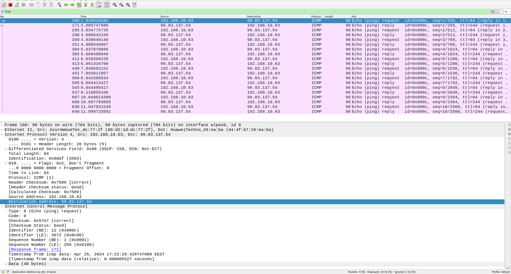
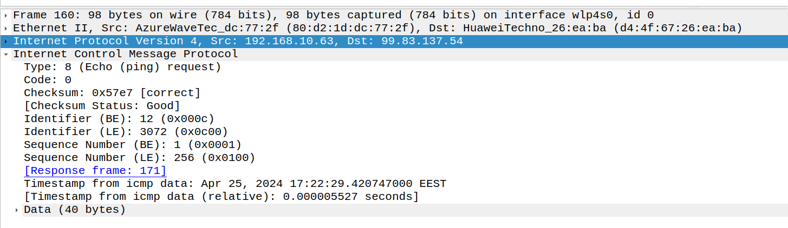
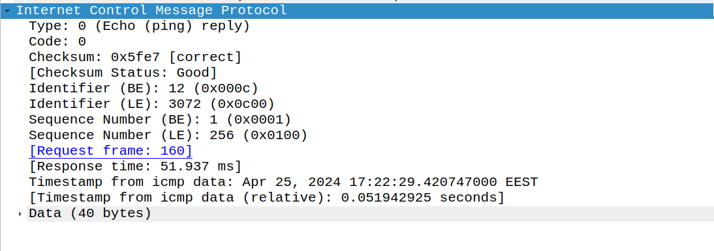
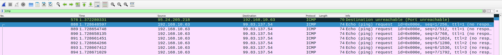
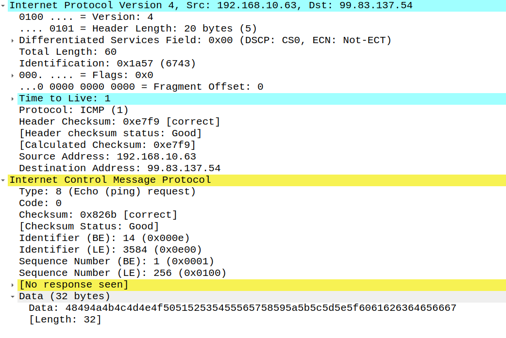
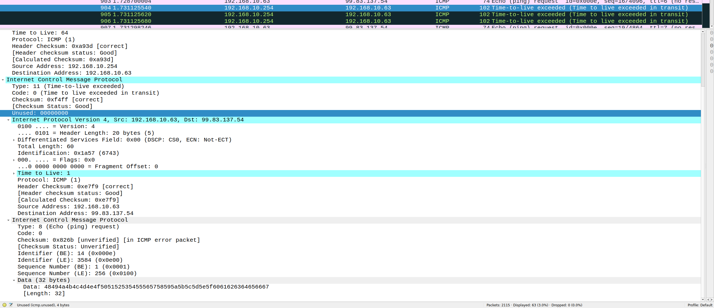
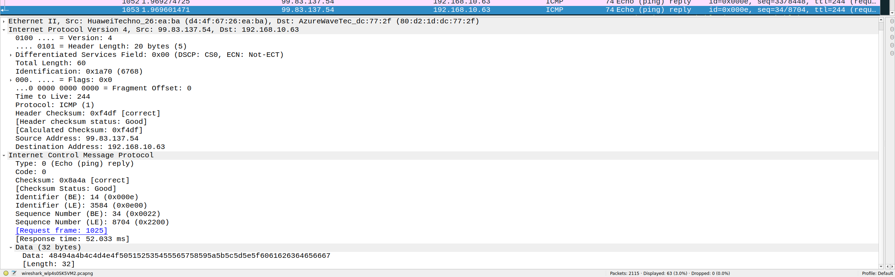

# Практика 9. Сетевой уровень

сделал:

Ping (4 балла)

Traceroute (4 балла)

IP-адрес и маска сети (1 балл) 

Доступные порты (2 балла)

Задача 1. Докажите формулы (3 балла)

Итого: 14

## Wireshark: ICMP
В лабораторной работе предлагается исследовать ряд аспектов протокола ICMP:
- ICMP-сообщения, генерируемые программой Ping
- ICMP-сообщения, генерируемые программой Traceroute
- Формат и содержимое ICMP-сообщения

### 1. Ping (4 балла) -- сделал
Программа Ping на исходном хосте посылает пакет на целевой IP-адрес; если хост с этим адресом
активен, то программа Ping на нем откликается, отсылая ответный пакет хосту, инициировавшему
связь. Оба этих пакета Ping передаются по протоколу ICMP.

Выберите какой-либо хост, расположенный на другом континенте (например, в Америке или
Азии). Захватите с помощью Wireshark ICMP пакеты от утилиты ping.
Для этого из командной строки запустите команду (аргумент `-n 10` означает, что должно быть
отослано 10 ping-сообщений): `ping –n 10 host_name`

Для анализа пакетов в Wireshark введите строку icmp в области фильтрации вывода.

#### Вопросы

Пингую `ucsd.edu`



1. Каков IP-адрес вашего хоста? Каков IP-адрес хоста назначения?
   - 192.168.10.63
   - 99.83.137.54
2. Почему ICMP-пакет не обладает номерами исходного и конечного портов?
   -  потому что это протокол сетевого уровня, а номера портов используются на транспортном уровне
3. Рассмотрите один из ping-запросов, отправленных вашим хостом. Каковы ICMP-тип и кодовый
   номер этого пакета? Какие еще поля есть в этом ICMP-пакете? Сколько байт приходится на поля 
   контрольной суммы, порядкового номера и идентификатора?



   - Type: 8 (Echo (ping) request). Code: 0
   - checksum, индентификатор, порядковый номер, timestamp
   - два байта на каждый: 6 в сумме
4. Рассмотрите соответствующий ping-пакет, полученный в ответ на предыдущий. 
   Каковы ICMP-тип и кодовый номер этого пакета? Какие еще поля есть в этом ICMP-пакете? 
   Сколько байт приходится на поля контрольной суммы, порядкового номера и идентификатора?



   - Type: 0 (Echo (ping) reply). Code: 0
   - checksum, индентификатор, порядковый номер, метка времени
   - два байта на каждый: 6 в сумме

### 2. Traceroute (4 балла) -- сделал
Программа Traceroute может применяться для определения пути, по которому пакет попал с
исходного на конечный хост.

Traceroute отсылает первый пакет со значением TTL = 1, второй – с TTL = 2 и т.д. Каждый
маршрутизатор понижает TTL-значение пакета, когда пакет проходит через этот маршрутизатор.
Когда на маршрутизатор приходит пакет со значением TTL = 1, этот маршрутизатор отправляет
обратно к источнику ICMP-пакет, свидетельствующий об ошибке.

Задача – захватить ICMP пакеты, инициированные программой traceroute, в сниффере Wireshark.
В ОС Windows вы можете запустить: `tracert host_name`

Выберите хост, который **расположен на другом континенте**.

#### Вопросы

```
traceroute to ucsd.edu (99.83.137.54), 30 hops max, 60 byte packets
 1  _gateway (192.168.10.254)  2.480 ms  2.474 ms  2.470 ms
 2  * * *
 3  hu0-2-1-0.400-iag1.lat.cyta-ip.net (195.14.131.227)  9.352 ms  9.349 ms  10.137 ms
 4  be15-icr1.lyk.cyta-ip.net (195.14.136.244)  9.342 ms  10.132 ms  10.129 ms
 5  be12-ipr1.lyk.cyta-ip.net (195.14.136.248)  10.125 ms  10.121 ms  10.454 ms
 6  amazon-th2.par.franceix.net (37.49.236.118)  60.868 ms * *
 7  * * *
 8  * * *
 9  * * *
10  * * *
11  acb2b7f80f439100a.awsglobalaccelerator.com (99.83.137.54)  52.092 ms  52.087 ms  51.722 ms
```



1. Рассмотрите ICMP-пакет с эхо-запросом на вашем скриншоте. Отличается ли он от ICMP-пакетов
   с ping-запросами из Задания 1 (Ping)? Если да – то как?



   - Появилось поле `Time to Live`, которого не было в ICMP-пакетах с ping-запросами
2. Рассмотрите на вашем скриншоте ICMP-пакет с сообщением об ошибке. В нем больше полей,
   чем в ICMP-пакете с эхо-запросом. Какая информация содержится в этих дополнительных полях?



   - Появилось поле `Unused: 00000000`, а также копия заголовков IP и ICMP
3. Рассмотрите три последних ICMP-пакета, полученных исходным хостом. Чем эти пакеты
   отличаются от ICMP-пакетов, сообщающих об ошибках? Чем объясняются такие отличия?



   - Они являются просто ответами на ping, имеют `Type: 0 (Echo (ping) reply)` и уже не содержат информации о заголовках отправленного пакета
   - Они являются ответами на пинг, а потому не содержат информации о заголовках отправленного пакета и знают какого TTL хватит чтобы дойти до отправителя
4. Есть ли такой канал, задержка в котором существенно превышает среднее значение? Можете
   ли вы, опираясь на имена маршрутизаторов, определить местоположение двух маршрутизаторов,
   расположенных на обоих концах этого канала?
   - наибольшая задержка на `amazon-th2.par.franceix.net (37.49.236.118)  60.868 ms * *`и потом на ` acb2b7f80f439100a.awsglobalaccelerator.com (99.83.137.54)  52.092 ms  52.087 ms  51.722 ms`
   - это были прыжки `Кипр -> Амстердам -> Сиэтл`

## Программирование.

### 1. IP-адрес и маска сети (1 балл) -- сделал
Напишите консольное приложение, которое выведет IP-адрес вашего компьютера и маску сети на консоль.

#### Демонстрация работы

```
$ python3 main.py                                                                                                                                                                        [22:21:06]
enp3s0: 127.0.0.1, mask = 255.0.0.0
tun0: 10.0.85.1, mask = 255.255.255.255
wlp4s0: 192.168.10.63, mask = 255.255.255.0
```

### 2. Доступные порты (2 балла) -- сделал
Выведите все доступные (свободные) порты в указанном диапазоне для заданного IP-адреса. 
IP-адрес и диапазон портов должны передаваться в виде входных параметров.

#### Демонстрация работы

```
buyolitsez@archlinux: ~/projects/6sem/networks-course/lab09/scan-ports lab09!
$ netstat -pnltu                                                                                                                                                                         [22:26:19]
(Not all processes could be identified, non-owned process info
 will not be shown, you would have to be root to see it all.)
Active Internet connections (only servers)
Proto Recv-Q Send-Q Local Address           Foreign Address         State       PID/Program name    
tcp        0      0 192.168.10.63:63270     0.0.0.0:*               LISTEN      935/deluge-gtk      
tcp        0      0 127.0.0.1:63270         0.0.0.0:*               LISTEN      935/deluge-gtk      
tcp        0      0 0.0.0.0:445             0.0.0.0:*               LISTEN      -                   
tcp        0      0 0.0.0.0:139             0.0.0.0:*               LISTEN      -                   
tcp        0      0 127.0.0.1:8867          0.0.0.0:*               LISTEN      22219/markdown-prev 
tcp        0      0 127.0.0.1:631           0.0.0.0:*               LISTEN      -                   
tcp6       0      0 :::445                  :::*                    LISTEN      -                   
tcp6       0      0 :::139                  :::*                    LISTEN      -                   
tcp6       0      0 ::1:631                 :::*                    LISTEN      -                   
udp        0      0 0.0.0.0:68              0.0.0.0:*                           -                   
udp        0      0 224.0.0.251:5353        0.0.0.0:*                           18033/msedge        
udp        0      0 224.0.0.251:5353        0.0.0.0:*                           923/chrome --ozone- 
udp        0      0 0.0.0.0:6771            0.0.0.0:*                           935/deluge-gtk      
udp        0      0 0.0.0.0:6771            0.0.0.0:*                           935/deluge-gtk      
udp        0      0 192.168.10.63:43688     0.0.0.0:*                           935/deluge-gtk      
udp        0   4608 192.168.10.63:63270     0.0.0.0:*                           935/deluge-gtk      
udp        0      0 127.0.0.1:63270         0.0.0.0:*                           935/deluge-gtk      
udp6       0      0 :::546                  :::*                                -                   
 
buyolitsez@archlinux: ~/projects/6sem/networks-course/lab09/scan-ports lab09!
$ python3 main.py 127.0.0.1 0 10000                                                                                                                                                      [22:26:21]
ports:
139
445
631
8867
```


## Задачи. Работа протокола TCP

### Задача 1. Докажите формулы (3 балла) -- сделал
Пусть за период времени, в который изменяется скорость соединения с $\frac{W}{2 \cdot RTT}$
до $\frac{W}{RTT}$, только один пакет был потерян (очень близко к концу периода).
1. Докажите, что частота потери $L$ (доля потерянных пакетов) равна
   $$L = \dfrac{1}{\frac{3}{8} W^2 + \frac{3}{4} W}$$
2. Используйте выше полученный результат, чтобы доказать, что, если частота потерь равна
   $L$, то средняя скорость приблизительно равна
   $$\approx \dfrac{1.22 \cdot MSS}{RTT \cdot \sqrt{L}}$$

#### Решение

1. всего было отправлено $\dfrac W 2 + (\dfrac W 2 + 1) + (\dfrac W 2 + 2) + \dots + (W - 1) + W$ пакетов, по сумме арифмитической прогрессии получаем, что отправлено ровно $\frac{3}{8} W^2 + \frac{3}{4} W$ пакетов, а потерян только один, значит частота потери равна $\dfrac{1}{\frac{3}{8} W^2 + \frac{3}{4} W}$

2. берем $W_{avg} = \frac 3 4 W$, тогда средняя скорость это $\frac 3 4 \frac W {RTT} MSS$, из пункта один получаем что $W \approx \sqrt{\frac 8 3 \frac 1 L}$, тем самым средняя скорость примерно равна 

$$\approx \frac 3 4 \frac {MSS} {RTT} \sqrt{\frac 8 3 \frac 1 L} \approx \dfrac {1.22 MSS} {RTT \sqrt L}$$

