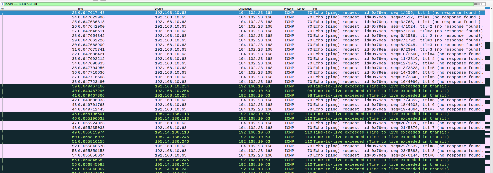

# Практика 10. Сетевой уровень

сделал:

Wireshark: IP, 1 2 3 5 7 (5 баллов)

Эхо-запросы через ICMP (7 баллов)

Итого: 12

## Wireshark: IP (8 баллов)
Для работы вам понадобится программа traceroute. При работе программа traceroute сначала
отправляет одну или несколько дейтаграмм, причем в поле предписанного времени жизни (TTL) в
IP-заголовке таких дейтаграмм устанавливается значение 1; затем программа посылает одну или
несколько дейтаграмм по тому же адресу, но в поле TTL уже ставится значение 2; далее процесс
повторяется с изменением значения TTL на 3 и т. д.

Маршрутизатор должен уменьшать на единицу значение в поле TTL каждой дейтаграммы,
которую получает. Если значение в поле TTL достигает 0, маршрутизатор возвращает 
ICMP-сообщение (тип 11 – значение TTL исчерпано) хосту-отправителю.

Таким образом хост, на котором выполняется программа traceroute, может узнать
идентификационные данные всех маршрутизаторов между собой и хостом назначения X. Для
этого ему достаточно свериться с IP-адресами источников дейтаграмм, содержащих сообщения
протокола ICMP о том, что их значение TTL достигло нуля.

Вам необходима версия программы traceroute, которая умеет рассылать дейтаграммы разной длины.
- Если вы работаете с Windows:
  Программа tracert, предоставляемая в Windows, не позволяет изменять размер сообщения 
  эхо-запроса ICMP (ping), посылаемого программой tracert. Для этого используйте программу
  [pingplotter](https://www.pingplotter.com/). Размер сообщения ICMP с эхо-запросом можно установить явно,
  выбрав команду меню Edit => Options => Default Settings => Engine, а затем указав значение в поле
  Packet Size.
- Если вы работаете с Unix:
  При помощи команды traceroute из операционных систем Unix можно явно устанавливать размер
  UDP-дейтаграммы, отправляемой на хост назначения (в Unix системах вместо ICMP используется
  UDP). Это значение вводится в командную строку traceroute сразу же за именем или адресом
  хоста назначения. Например, чтобы отправить дейтаграммы traceroute размером 2000 байт на
  адрес gaia.cs.umass.edu, может использоваться следующая команда:
  `traceroute gaia.cs.umass.edu 2000`

#### Подготовка
1. Запустите программу Wireshark и начните захват пакетов.
2. Запустите pingplotter, выберите имя какого-либо целевого хоста (например, akamai.com).
   Запустите трассировку для размера пакета Packet Size = 56 байт.
3. Остановите трассировку Wireshark.

#### Вопросы
В вашей трассе вы должны видеть ряд эхо-запросов по протоколу ICMP (при работе с
Windows) или UDP-сегмент (в случае с Unix).

1. Выберите первое ICMP-сообщение эхо-запроса, отправленное вашим компьютером, и
   раскройте часть информации о пакете Internet Protocol в окне подробной информации.
   Каков IP-адрес вашего компьютера?
   - 192.168.10.63

2. Найдите заголовок IP-пакета. Какое значение указано здесь в поле протокола верхнего уровня?

   - Protocol: ICMP (1)

3. Сколько байт в IP-заголовке? Сколько байт приходится на полезную нагрузку IP-дейтаграммы?
   - 20
   - 36

5. Какое значение содержится в поле Identification (Идентификация), а какое – в поле TTL
   (выберите какой-либо один пакет ICMP)?

   - 0x53c5
   - 1

7. Найдите серии откликов ICMP, в которых содержатся сообщения об истечении
   предписанного времени жизни (time-to-live exceeded). Выберите один из пакетов.
   Какое значение содержится в поле Identification (Идентификация), а какое – в поле TTL?
   - Identification: 0x1b32 (6962)
   - Time to Live: 64

## Программирование.

### 1. Эхо-запросы через ICMP (8 баллов)
Реализуйте консольное приложение для эхо-запросов (пингования) с помощью ICMP-запросов и
ответов. Приложение отправляет ICMP-пакеты («эхо-запрос» или «пинг») на целевой хост и
слушает ICMP-ответы («эхо-ответ») от него. Обычно при получении ответов измеряется время
оборота (RTT), фиксируются потери пакетов и выводится статистическая сводка о полученных
ответах (минимальное, максимальное и среднее значение времени оборота, а в некоторых
версиях еще и стандартное отклонение от среднего).

Вам потребуется написать только клиентскую часть программы, а функциональные возможности,
необходимые на стороне сервера, встроены почти во все операционные системы.
Приложение должно отправлять эхо-запросы на определенный хост через одну секунду. Каждое
такое сообщение-запрос содержит данные, которые включают в себя отметку времени. После
отправки каждого пакета приложение ждет получения ответного сообщения в течение одной
секунды. Если ответа нет, то клиент предполагает, что пакет запроса или ответный пакет
были потеряны в сети (или целевой хост недоступен).

В этой работе необходимо будет разобраться с тем, как организовать проверку контрольных сумм
и создание заголовков для ICMP пакетов.

### Задание А (6 баллов) -- сделал
Реализуйте приложение для эхо-запросов (пингования) с помощью ICMP-запросов и ответов.

Сделайте скриншоты результатов пингования **двух различных** хостов назначения, находящихся
**на разных континентах**.

#### Демонстрация работы

---

### Задание Б (1 балл) -- сделал
Организуйте вывод на консоль так, как это сделано в стандартной утилите ping: нужно вывести
минимальное, максимальное и среднее значение RTT в конце каждого ответа от сервера.
Дополнительно вычислите коэффициент потери пакетов (в процентах).

#### Демонстрация работы

смотреть выше

