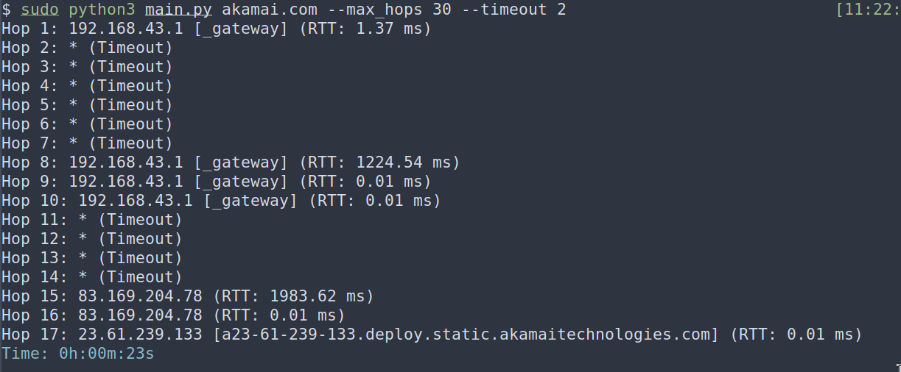
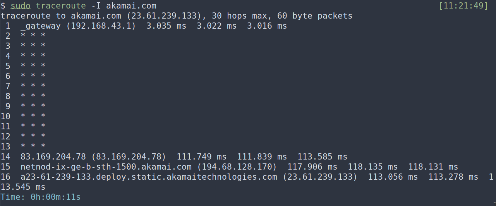
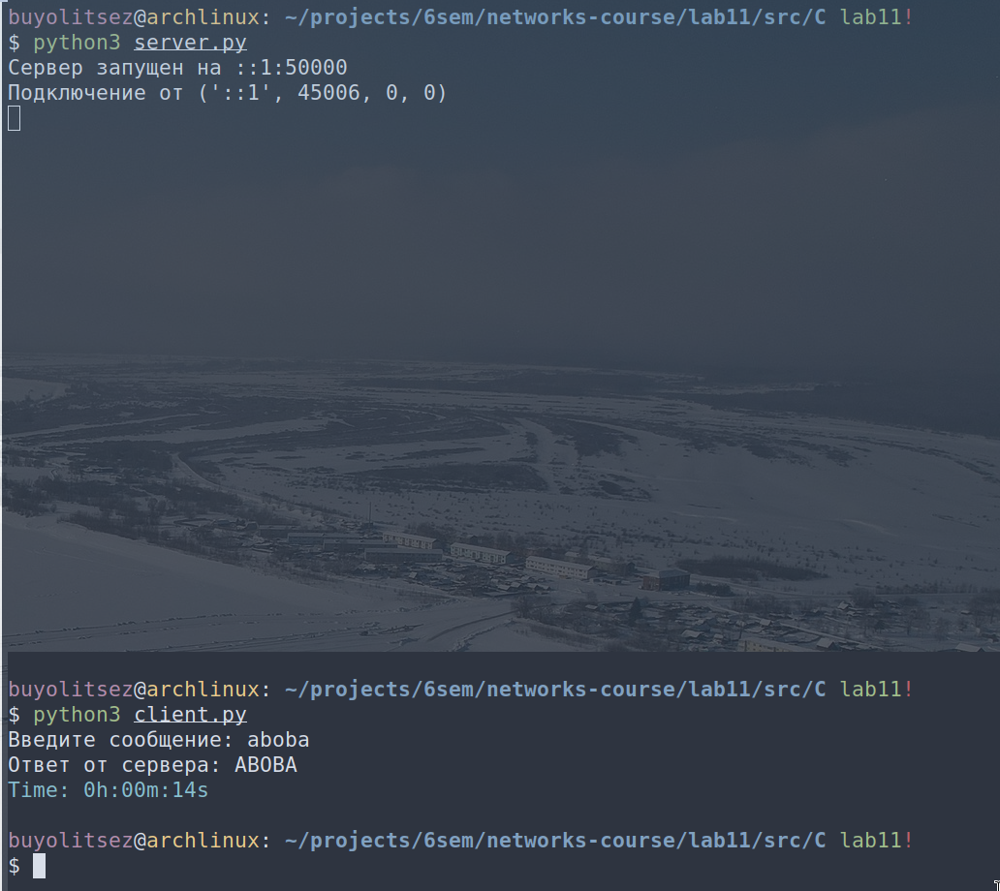
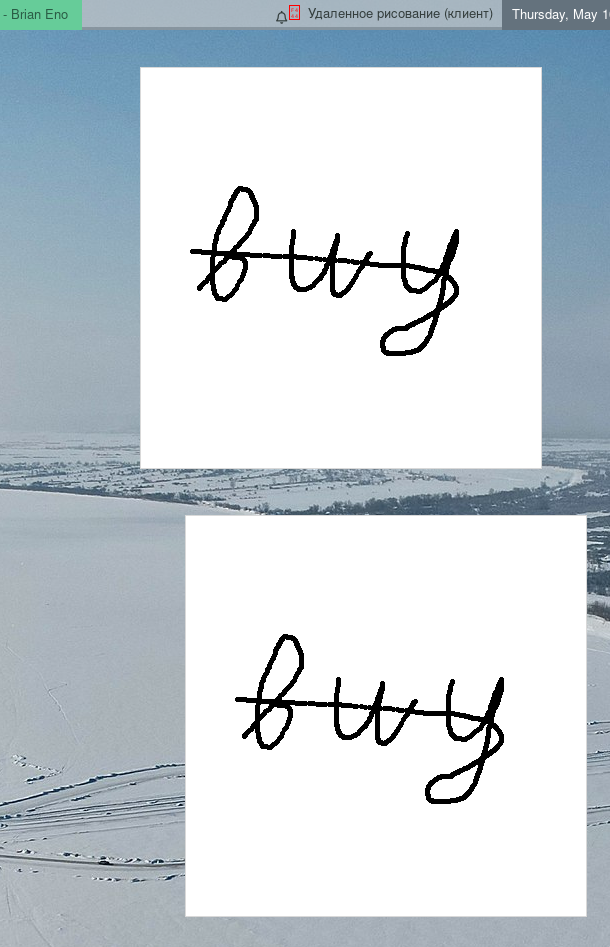

# Практика 11. Сетевой уровень

сделал:

Трассировка маршрута с использованием ICMP (8 баллов)

Использование протокола IPv6 (2 балла)

Удаленное рисование (6 баллов)

Итого: 16

## Трассировка маршрута с использованием ICMP (8 баллов)
Трассировка осуществляется посредством сообщений протокола ICMP. Эхо-запрос 
(ICMP-сообщение с типом «8») отправляется одному и тому же хосту назначения с увеличением с
каждым шагом значения поля TTL (времени жизни) на единицу. Маршрутизаторы на пути
следования пакета возвращают обратно запрашивающему хосту ICMP-сообщение об истечении
времени (ICMP-сообщение с типом «11»), когда поле TTL становится равным нулю. При
достижении хоста назначения тот в ответ отправляет ICMP-сообщение с типом «0» (эхо-ответ). Из
полученных ответов можно извлечь IP-адреса всех маршрутизаторов на пути следования пакета, а
также время оборота (RTT) до каждого из узлов на маршруте.

**Не используйте готовые библиотеки для работы с ICMP**, предложите свое решение на сокетах.

### Задание А. Основное приложение (6 баллов) -- сделал
Основная задача – разработать свое собственное (клиентское) приложение трассировки, которое
будет использовать протокол ICMP.
Должен быть выведен на консоль список IP-адресов всех маршрутизаторов на пути от источника к
хосту назначения. Количество сообщений, которые будут отправляться каждому маршрутизатору,
должно настраиваться параметром и по каждому из пакетов должно выводиться время RTT (по
умолчанию утилита tracert использует три пакета).

#### Демонстрация работы

Моя программа:

Для сравнения, вывод traceroute:

### Задание Б. Вывод имен промежуточных узлов (2 балла) -- сделал
В настоящее время приложение выводит только список IP-адресов всех маршрутизаторов на пути
от источника к хосту назначения. Попробуйте использовать метод (например, gethostbyname) для
получения имени каждого промежуточного узла маршрута и выводить также на консоль это имя.
Предоставьте скриншот результатов трассировки какого-либо хоста.

#### Демонстрация работы

## Использование протокола IPv6 (2 балла) -- сделал
Реализуйте простое клиент-серверное приложение, реализующее эхо-запросы: клиент посылает
серверу текстовое сообщение, а в ответ сервер отправляет то же сообщение, но в верхнем
регистре. Приложение должно работать на сокетах, которые настроены на работу по протоколу
TCP с обязательным использованием протокола IPv6 на сетевом уровне.

#### Демонстрация работы

## Удаленное рисование (6 баллов) -- сделал
Программа удаленного рисования. На первом компьютере (клиент) пользователь может рисовать
кривые мышкой на «холсте». На втором на таком же холсте (сервер) рисунок повторяется в
реальном времени. Вы можете использовать любой протокол для реализации данного
приложения. Предоставьте скриншот работы приложения.

#### Демонстрация работы

