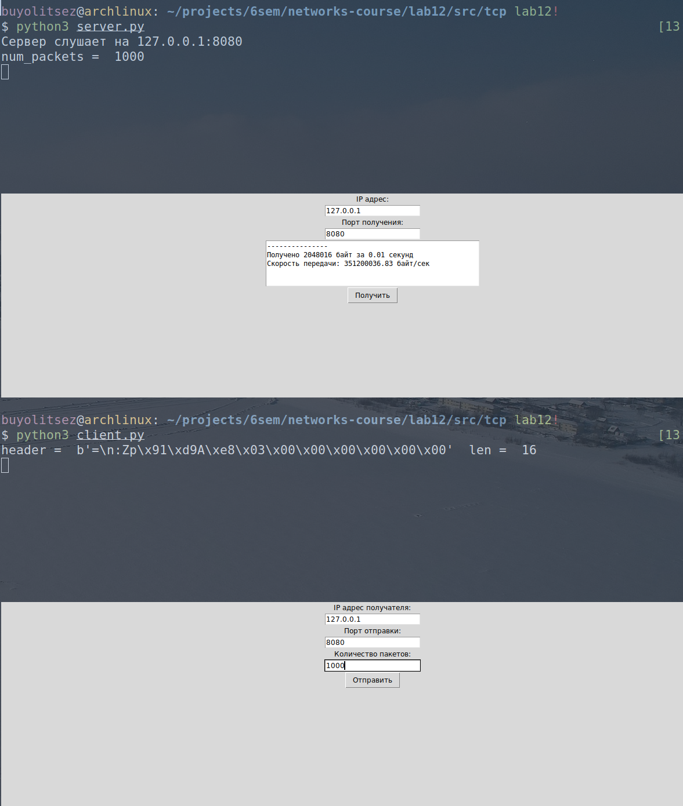

# Практика 12. Сетевой уровень

сделал:

RIP A+B (7 баллов) 

Скорость передачи (6 баллов)

итого: 13

## 1. RIP (9 баллов)

### Задание А (6 баллов) -- сделал
Реализуйте эмулятор работы протокола RIP в виде консольного приложения.
Ваша автономная сеть (АС) из маршрутизаторов может быть сконфигурирована на основе файла
(например, `.json`) либо генерироваться случайным образом каждый раз при запуске.

Каждый маршрутизатор должен иметь свой уникальный IP адрес. Это приложение не
предполагает передачу данных по сети, поэтому IP адреса, как и связи между маршрутизаторами,
могут быть произвольными.

Программа должна корректно работать с произвольной АС.

В конце работы программы для каждого маршрутизатора должна быть выведена таблица
маршрутизации. Пример таблицы:
```
Final state of router 198.71.243.61 table:
[Source IP]      [Destination IP]    [Next Hop]       [Metric]  
198.71.243.61    122.136.243.149     42.162.54.248           4  
198.71.243.61    157.105.66.180      42.162.54.248           2  
198.71.243.61    229.28.61.15        42.162.54.248           3  
198.71.243.61    42.162.54.248       42.162.54.248           1  
```

Приведите скрин или лог работы программы.

#### Демонстрация работы

ниже

### Задание Б (1 балл) -- сделал
Выведите на консоль промежуточные этапы работы протокола: по каждому маршрутизатору
должна быть выведена его текущая таблица маршрутизации.

```
Simulation step 3 of router 42.162.54.248
[Source IP]      [Destination IP]    [Next Hop]       [Metric]  
42.162.54.248    122.136.243.149     157.105.66.180          3  
42.162.54.248    157.105.66.180      157.105.66.180          1  
42.162.54.248    229.28.61.15        157.105.66.180          2  
42.162.54.248    198.71.243.61       198.71.243.61           1  
```

#### Демонстрация работы


```
Initial state of router 192.168.1.0 table:
[Source IP]       [Destination IP]     [Next Hop]        [Metric]
192.168.1.0       192.168.1.4          192.168.1.4              7
192.168.1.0       192.168.1.0          192.168.1.0              1
192.168.1.0       192.168.1.2          192.168.1.2              4
192.168.1.0       192.168.1.3          192.168.1.3              6

Initial state of router 192.168.1.1 table:
[Source IP]       [Destination IP]     [Next Hop]        [Metric]
192.168.1.1       192.168.1.0          192.168.1.0             10
192.168.1.1       192.168.1.3          192.168.1.3              5

Initial state of router 192.168.1.2 table:
[Source IP]       [Destination IP]     [Next Hop]        [Metric]
192.168.1.2       192.168.1.2          192.168.1.2              1
192.168.1.2       192.168.1.0          192.168.1.0              3

Initial state of router 192.168.1.3 table:
[Source IP]       [Destination IP]     [Next Hop]        [Metric]
192.168.1.3       192.168.1.2          192.168.1.2              8
192.168.1.3       192.168.1.1          192.168.1.1              1

Initial state of router 192.168.1.4 table:
[Source IP]       [Destination IP]     [Next Hop]        [Metric]
192.168.1.4       192.168.1.3          192.168.1.3              2
192.168.1.4       192.168.1.1          192.168.1.1              9

Simulation step 1 of router 192.168.1.0
[Source IP]       [Destination IP]     [Next Hop]        [Metric]
192.168.1.0       192.168.1.4          192.168.1.4              7
192.168.1.0       192.168.1.0          192.168.1.0              1
192.168.1.0       192.168.1.2          192.168.1.2              4
192.168.1.0       192.168.1.3          192.168.1.3              6
192.168.1.0       192.168.1.1          192.168.1.4             16

Simulation step 1 of router 192.168.1.0
[Source IP]       [Destination IP]     [Next Hop]        [Metric]
192.168.1.0       192.168.1.4          192.168.1.4              7
192.168.1.0       192.168.1.0          192.168.1.0              1
192.168.1.0       192.168.1.2          192.168.1.2              4
192.168.1.0       192.168.1.3          192.168.1.3              6
192.168.1.0       192.168.1.1          192.168.1.3              7

Simulation step 1 of router 192.168.1.1
[Source IP]       [Destination IP]     [Next Hop]        [Metric]
192.168.1.1       192.168.1.0          192.168.1.0             10
192.168.1.1       192.168.1.3          192.168.1.3              5
192.168.1.1       192.168.1.4          192.168.1.0             17
192.168.1.1       192.168.1.2          192.168.1.0             14
192.168.1.1       192.168.1.1          192.168.1.0             17

Simulation step 1 of router 192.168.1.1
[Source IP]       [Destination IP]     [Next Hop]        [Metric]
192.168.1.1       192.168.1.0          192.168.1.0             10
192.168.1.1       192.168.1.3          192.168.1.3              5
192.168.1.1       192.168.1.4          192.168.1.0             17
192.168.1.1       192.168.1.2          192.168.1.3             13
192.168.1.1       192.168.1.1          192.168.1.3              6

Simulation step 1 of router 192.168.1.2
[Source IP]       [Destination IP]     [Next Hop]        [Metric]
192.168.1.2       192.168.1.2          192.168.1.2              1
192.168.1.2       192.168.1.0          192.168.1.0              3
192.168.1.2       192.168.1.4          192.168.1.0             10
192.168.1.2       192.168.1.3          192.168.1.0              9
192.168.1.2       192.168.1.1          192.168.1.0             10

Simulation step 1 of router 192.168.1.3
[Source IP]       [Destination IP]     [Next Hop]        [Metric]
192.168.1.3       192.168.1.2          192.168.1.2              8
192.168.1.3       192.168.1.1          192.168.1.1              1
192.168.1.3       192.168.1.0          192.168.1.2             11
192.168.1.3       192.168.1.4          192.168.1.2             18
192.168.1.3       192.168.1.3          192.168.1.2             17

Simulation step 1 of router 192.168.1.3
[Source IP]       [Destination IP]     [Next Hop]        [Metric]
192.168.1.3       192.168.1.2          192.168.1.2              8
192.168.1.3       192.168.1.1          192.168.1.1              1
192.168.1.3       192.168.1.0          192.168.1.2             11
192.168.1.3       192.168.1.4          192.168.1.2             18
192.168.1.3       192.168.1.3          192.168.1.1              6

Simulation step 1 of router 192.168.1.4
[Source IP]       [Destination IP]     [Next Hop]        [Metric]
192.168.1.4       192.168.1.3          192.168.1.3              2
192.168.1.4       192.168.1.1          192.168.1.3              3
192.168.1.4       192.168.1.2          192.168.1.3             10
192.168.1.4       192.168.1.0          192.168.1.3             13
192.168.1.4       192.168.1.4          192.168.1.3             20

Final state of router 192.168.1.0 table:
[Source IP]       [Destination IP]     [Next Hop]        [Metric]
192.168.1.0       192.168.1.4          192.168.1.4              7
192.168.1.0       192.168.1.0          192.168.1.0              1
192.168.1.0       192.168.1.2          192.168.1.2              4
192.168.1.0       192.168.1.3          192.168.1.3              6
192.168.1.0       192.168.1.1          192.168.1.3              7

Final state of router 192.168.1.1 table:
[Source IP]       [Destination IP]     [Next Hop]        [Metric]
192.168.1.1       192.168.1.0          192.168.1.0             10
192.168.1.1       192.168.1.3          192.168.1.3              5
192.168.1.1       192.168.1.4          192.168.1.0             17
192.168.1.1       192.168.1.2          192.168.1.3             13
192.168.1.1       192.168.1.1          192.168.1.3              6

Final state of router 192.168.1.2 table:
[Source IP]       [Destination IP]     [Next Hop]        [Metric]
192.168.1.2       192.168.1.2          192.168.1.2              1
192.168.1.2       192.168.1.0          192.168.1.0              3
192.168.1.2       192.168.1.4          192.168.1.0             10
192.168.1.2       192.168.1.3          192.168.1.0              9
192.168.1.2       192.168.1.1          192.168.1.0             10

Final state of router 192.168.1.3 table:
[Source IP]       [Destination IP]     [Next Hop]        [Metric]
192.168.1.3       192.168.1.2          192.168.1.2              8
192.168.1.3       192.168.1.1          192.168.1.1              1
192.168.1.3       192.168.1.0          192.168.1.2             11
192.168.1.3       192.168.1.4          192.168.1.2             18
192.168.1.3       192.168.1.3          192.168.1.1              6

Final state of router 192.168.1.4 table:
[Source IP]       [Destination IP]     [Next Hop]        [Metric]
192.168.1.4       192.168.1.3          192.168.1.3              2
192.168.1.4       192.168.1.1          192.168.1.3              3
192.168.1.4       192.168.1.2          192.168.1.3             10
192.168.1.4       192.168.1.0          192.168.1.3             13
192.168.1.4       192.168.1.4          192.168.1.3             20

```


## Скорость передачи (6 баллов) -- сделал
Реализуйте программу, которая измеряет скорость передачи информации по протоколам TCP и
UDP, а также выводит количество потерянных пакетов.

Программа состоит из двух частей: клиента и сервера. Клиент создает трафик случайным образом
(т.е. генерируется случайная последовательность данных) и отправляет их на сервер. Сервер
подсчитывает количество полученных данных и выводит результат. Время отправки указывается
клиентом вместе с данными.

Ваше приложение должно иметь GUI.

### 1. Измерение по протоколу TCP (3 балла) -- сделал
Пример интерфейса:


#### Демонстрация работы

сначала надо нажать "Получить" на сервере, а потом "Отправить" на клиенте



### 2. Измерение по протоколу UDP (3 балла) -- сделал
Пример интерфейса:


#### Демонстрация работы


   
