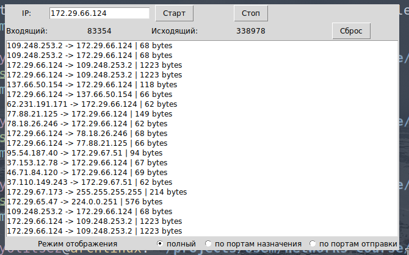
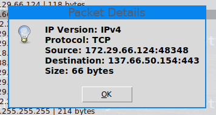
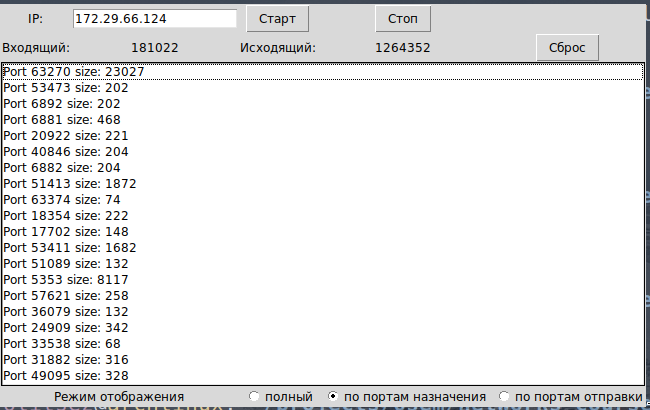
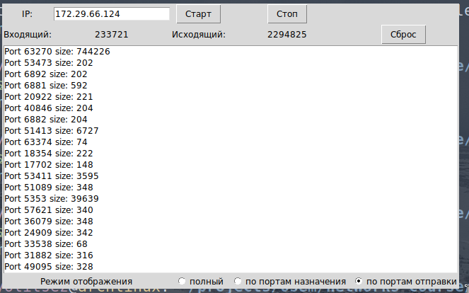

# Практика 13. Канальный уровень


сделал:

Проверка целостности пакетов (4 балла)

Подсчет сетевого трафика (8 баллов)

Задача 1. (2 балла)

Задача 3 (2 балла)

Итого: 16


## Программирование

### Проверка целостности пакетов (4 балла) -- сделал
Реализуйте проверку целостности пакетов на основе кодов циклического контроля (Cyclic
Redundancy Check, CRC).

Реализуйте тесты, показывающие корректность работы вашего решения. Для этого
предусмотрите возможность внесения ошибки (искажения) в одном или нескольких битах
данных.

Сценарий для основного теста: вводится текст, который разбивается на пакеты длинной 5 байт
(полезные данные), в некоторых из пакетов возникает ошибка (искусственная: искажение
отдельных битов). Вы должны определить, в каких пакетах возникла ошибка. Для каждого пакета
выведите на экран: полезные передаваемые данные, пакет в закодированном виде, контрольный
код.

```
$ python crc_check.py "Hello World and lab13"                                          
Original Packets:
IndexData           Encoded                       CRC       
0    b'Hello'       b'Hello\xda\xda'              56026     
1    b' Worl'       b' WorlI\xe5'                 18917     
2    b'd and'       b'd and\x1e\xc4'              7876      
3    b' lab1'       b' lab1\xe89'                 59449     
4    b'3'           b'3\xe7\xc0'                  59328     

Packets with Potential Errors:
IndexData           Encoded                       CRC       
0    b'Hello'       b'Hello\xda\xda'              56026     
1    b' W\x90rl'    b' W\x90rlI\xe5'              18917     
2    b'd \x9end'    b'd \x9end\x1e\xc4'           7876      
3    b' lab1'       b' lab1\xe89'                 59449     
4    b'3'           b'3\x18\xc0'                  6336      

Packet Verification:
Packet 0: No error
Packet 1: Error detected
Packet 2: Error detected
Packet 3: No error
Packet 4: Error detected
```

### Подсчет сетевого трафика (8 баллов) -- сделал

### Задание А (2 балла)
Разработать приложение, подсчитывающее входящий и исходящий сетевой трафик без учета
его природы.

### Задание Б (2 балла)
Разработать приложение, подсчитывающее входящий и исходящий сетевой трафик с учетом
приложения (порта), для которого данный трафик предназначен. Приложение должно
формировать отчет с разделением трафика по портам назначения/отправки.

### Задание В (4 балла)
Разработать приложение, анализирующее весь сетевой трафик подсети. Приложение должно
перехватывать не только трафик, адресованный данному узлу, но и анализировать пакеты,
адресованные другим узлам сети.

При выделении записи в списке должна всплывать подсказка (hint) с более подробной
информацией: транспортный протокол (TCP/UDP), версия IP протокола, порт отправителя, порт
получателя, размер переданных данных, адреса отправителя и получателя.

Пример GUI приложения:


Приложение поддерживает три режима работы: отображение полного списка всех
проходящих пакетов с суммированием входящего и исходящего трафика (при нажатии на пакет в
списке выводится подробная информация); отображение суммарного входящего и исходящего
трафика по портам. 

#### Демонстрация работы










## Задачи

### Задача 1. (2 балла) -- сделал
Вывод значения эффективности дискретного протокола ALOHA.
1. При наличии $N$ активных узлов эффективность дискретного протокола ALOHA равна 
   $N \cdot p (1 - p)^{N - 1}$. Найдите значение $p$, максимизирующее результат этого выражения.
2. Воспользовавшись значением $p$, найденным в пункте (1), найдите эффективность дискретного
протокола ALOHA, когда $N$ стремится к бесконечности.

#### Решение

1) обозначим:

$$
E(p) = N \cdot p (1 - p)^{N-1}
$$

тогда:

$$
\frac{dE(p)}{dp} = N \left[ (1 - p)^{N-1} + p \cdot (N-1) \cdot (1 - p)^{N-2} \cdot (-1) \right]
$$

$$
= N \left[ (1 - p)^{N-1} - p (N-1) (1 - p)^{N-2} \right]
$$

$$
= N (1 - p)^{N-2} \left[ (1 - p) - p (N-1) \right]
$$

$$
= N (1 - p)^{N-2} \left[ 1 - p - pN + p \right]
$$

$$
= N (1 - p)^{N-2} \left[ 1 - pN \right]
$$

Приравниваем производную к нулю:

$$
N (1 - p)^{N-2} (1 - pN) = 0
$$

$$
(1 - p)^{N-2} \neq 0 \quad \text{для} \quad p \neq 1
$$

$$
1 - pN = 0
$$

$$
pN = 1
$$

Значит, $p = \frac{1}{N}$ оптимально


2) Подставим:

$$
E \left( \frac{1}{N} \right) = N \cdot \frac{1}{N} \left( 1 - \frac{1}{N} \right)^{N-1}
$$

$$
= \left( 1 - \frac{1}{N} \right)^{N-1}
$$

При $N \to \infty$ у нас $\left(1 - \frac{1}{N}\right)^N \approx \dfrac 1 e$


### Задача 3 (2 балла) -- сделал
Рассмотрим широковещательный канал с $N$ узлами и скоростью передачи данных $R$ бит/с.
Предположим, что в этом широковещательном канале используется опрос (опрос
выполняется отдельным узлом) для множественного доступа. Допустим, что количество
времени, за которое узел осуществляет передачу данных до соседнего узла (то есть, задержка
при опросе) составляет $d_{\text{опрос}}$. Также будем исходить из того, что в каждом раунде опроса
конкретному узлу разрешается передавать не более $Q$ бит. Какова будет максимальная
пропускная способность широковещательного канала?

#### Решение


1. время для опроса одного узла и передачи данных:

   $$
   T = d + \frac{Q}{R}
   $$

   $d$ — задержка при опросе, $\frac{Q}{R}$ — время передачи $Q$ бит с скоростью $R$ бит/с.

2. время $T$ один узел передает $Q$ бит данных.

3. время $N \cdot T$ все $N$ узлов передают $N \cdot Q$ бит данных.

4. максимальная пропускная способность $S_{\text{max}}$:

   $$
   S_{\text{max}} = \frac{N \cdot Q}{N \cdot T} = \frac{N \cdot Q}{N \left( d + \frac{Q}{R} \right)} = \frac{Q}{d + \frac{Q}{R}}
   $$

