# Практика 14. Канальный уровень

сделал:

A. Токен доступа (4 балла)

Б. Приветственное сообщение (6 баллов)

Задача 2 (4 балла)

итого: 14


## Программирование.

### Rest Service и токены доступа (10 баллов) --- сделал
Продолжите работу с REST сервисом, созданным вами ранее в самом первом домашнем задании.

### A. Токен доступа (4 балла) --- сделал
Поддержите возможность регистрации пользователя в вашем сервисе. При этом не используйте
уже готовые фреймворки и решения. Предложите свою «наивную» реализацию.

В этом задании достаточно все данные хранить в памяти, т.о. базу данных использовать НЕ
обязательно. Также вы можете при желании выгружать данные локально на диск (например,
сериализовать в файл).

Пользователь регистрируется, его данные сохраняются на стороне сервиса.

Новые операции, которые должен поддерживать сервис:
1. Зарегистрировать нового пользователя по адресу его почты и паролю 
   (email выступает в качестве логина пользователя).
   - `POST /user/sign-up`
   - Схема запроса:
     ```json
     {
         "email": "string",
         "password": "string"
     }
     ```
2. Авторизовать пользователя по логину и паролю. Сервис высылает обратно на сторону
   клиента токен доступа (можно использовать случайно сгенерированную строку)
   - `POST /user/sign-in`
   - Схема запроса:
     ```json
     {
         "email": "string",
         "password": "string"
     }
     ```
   - Схема ответа:
     ```json
     {
         "token": "string"
     }
     ```

Теперь во все операции с сервисом клиент может передавать полученный токен.
Если токен передан, то сервер понимает, кто это и разрешает доступ к расширенному функционалу.

1. Добавить новый продукт
   - `POST /product?token=<token>`
   - Если токен был передан, то созданный продукт будет ассоциирован с данным пользователем
   - Иначе продукт будет публичным
2. Получить/Обновить/Удалить продукт
   - `GET/PUT/DELETE /product/{product_id}?token=<token>`
   - Если токен был передан, то пользователь помимо публичных продуктов имеет доступ к своим собственным
   - Иначе пользователь имеет доступ **только** к публичным продуктам
3. Получить список всех продуктов
   - `GET /products?token=<token>`
   - Аналогично операции получения одного продукта — авторизованный
     пользователь получает расширенный список продуктов

Продемонстрируйте работоспособность вашего решения с помощью программы Postman:
запустите операции с токеном и без него и приложите скрин.

#### Демонстрация работы

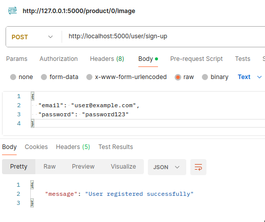

---

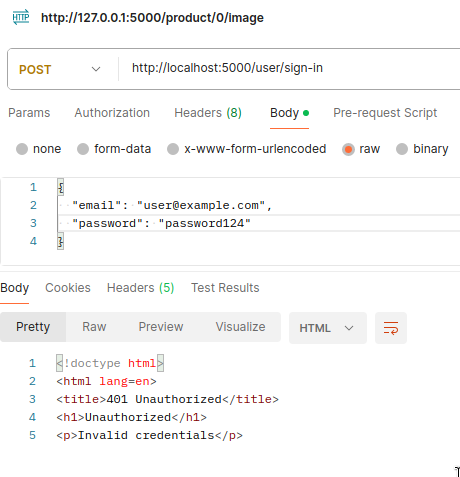

---

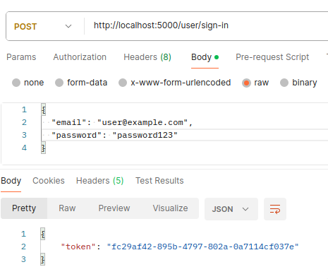

---

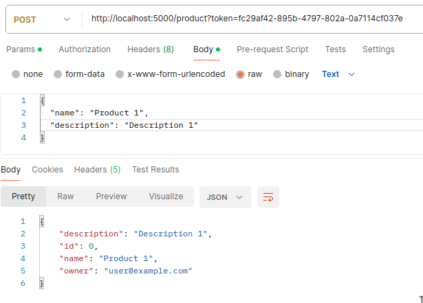

---

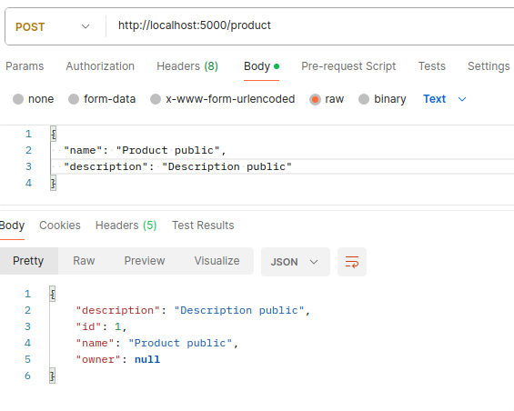

---

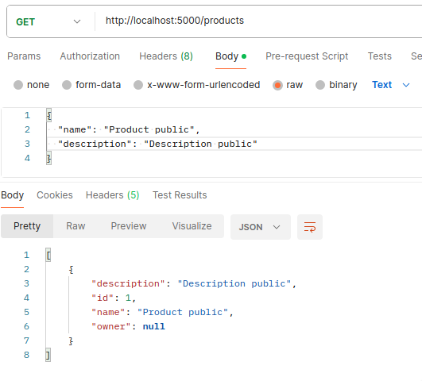

---

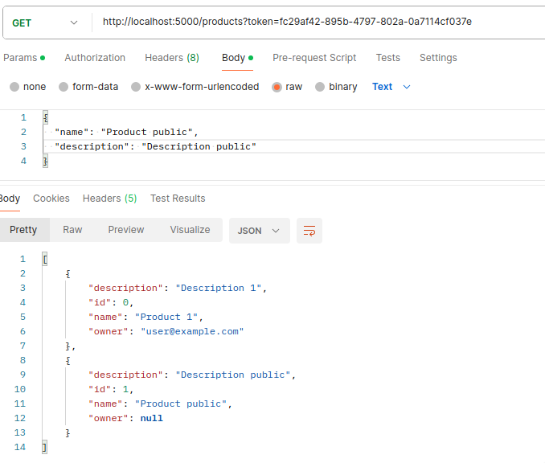

---

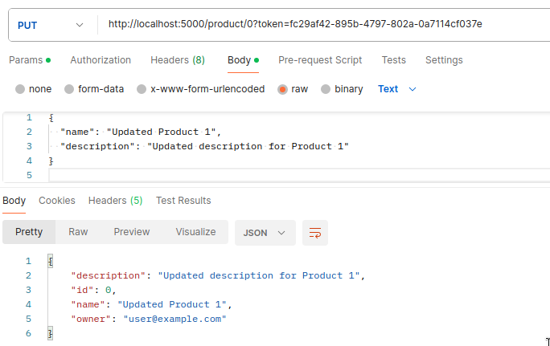

---

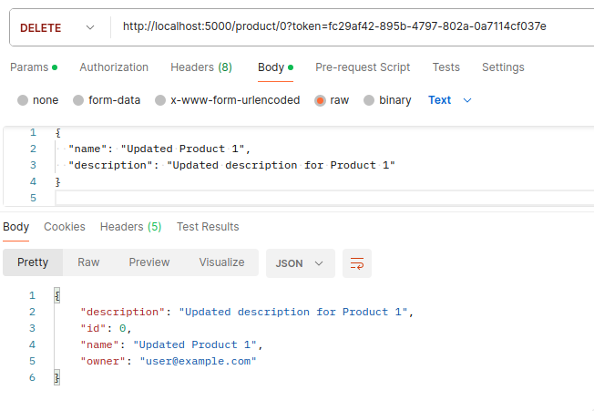

---

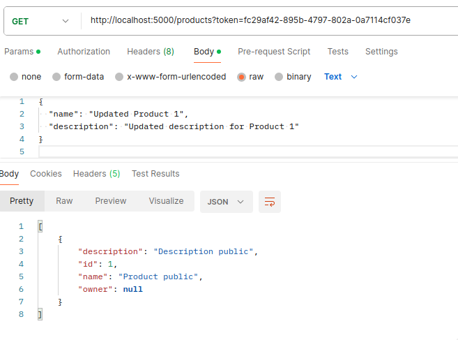

### Б. Приветственное сообщение (6 баллов) --- сделал
Если пользователь использовал сервис без токена и посмотрел хотя бы один товар (по `product_id` или
список всех товаров), то ему на почту отправляется приветственный текст (например, "Рады видеть вас в
нашем сервисе вновь!").

Откуда сервису известен email пользователя? Сервис при регистрации пользователя запоминает
IP-адрес и привязывает его к учетке пользователя.

Будем считать, что, когда пользователь пользуется сервисом без регистрации (не предоставляет
токен доступа), но его IP-адрес есть среди списка зарегистрированных пользователей,
определяется email.

Приветственный email отправляется не сразу, а по истечении заданного времени (можно
использовать таймер). Каждый раз, когда пользователь вызывает какой-либо метод, таймер
сбрасывается.

Таким образом пользователь получит лишь один email после того, как закончит работать с сервисом:
пройдет определенное время и сработает таймер (один раз).

#### Демонстрация работы


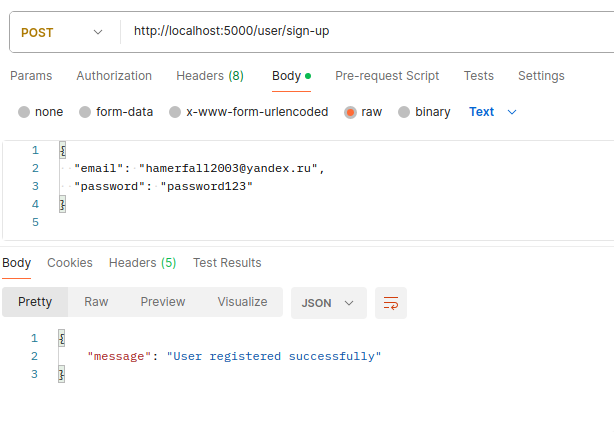

---

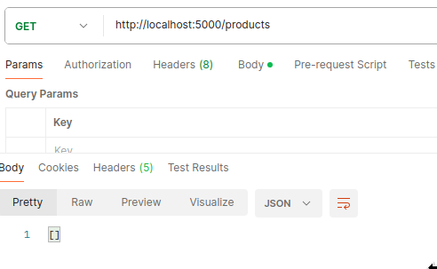

---

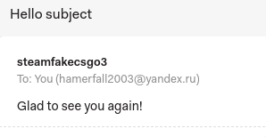

## Задачи

### Задача 2 (4 балла)
Исследуем применение небольших пакетов в приложениях для IP-телефонии. Один из
недостатков, связанных с небольшим размером пакетов, заключается в следующем: значительная
часть полосы передачи данных в канале тратится на пересылку лишних байт. Поэтому
предположим, что пакет состоит из $P$ байт плюс $5$ байт заголовка.
1. Рассмотрим непосредственную отправку исходного голосового материала в цифровой форме.
Предположим, что звук закодирован с постоянным битрейтом $128$ кбит/с. Также будем исходить
из того, то каждый пакет заполняется целиком, и лишь после этого источник отсылает пакет в сеть.
Время, требуемое на наполнение пакета, называется **задержкой пакетирования**. В контексте $L$
определите задержку пакетирования в миллисекундах.
2. Задержка пакетирования, превышающая $20$ мс, может провоцировать заметное и неприятное
эфирное эхо. Определите задержку пакетизации для $L = 1500$ байт (что примерно соответствует
максимальному размеру Ethernet-пакета) и для $L = 50$ (примерно соответствует размеру ATM-пакета).
3. Вычислите задержку, возникающую при продвижении пакетов с промежуточным хранением
для одного коммутатора при скорости передачи в канале $R = 622$ Мбит/с, для значений $L = 1500$
байт и $50$ байт.
4. Опишите преимущества, связанные с использованием пакетов небольшого размера. 

#### Решение


##### 1.

$$
\frac{(L + 5) \times 8}{128000} \times 1000 = \frac{(L + 5)}{16} мс
$$

##### 2.

1. Для $L = 1500$ байт:
$$
\frac{(1500 + 5)}{16} \approx 94.0625 мс
$$

2. Для $L = 50$ байт:
$$
\frac{(50 + 5)}{16} \times 1000 \approx 3.4375 мс
$$


##### 3.

$$
\frac{(P + 5) \times 8}{622 \times 10^6} \times 1000 = \frac{(P + 5)}{77750} мс
$$


1. Для $L = 1500$ байт:
$$
\frac{(1500 + 5)}{77750} \approx 0.019 мс
$$

2. Для $L = 50$ байт:
$$
\frac{(50 + 5)}{77750} \approx 0.0007 мс
$$

##### 4.

позволяет снизить задержку, уменьшить вероятность ошибок в пакетах и быстрее обрабатывать при большой нагрузке
